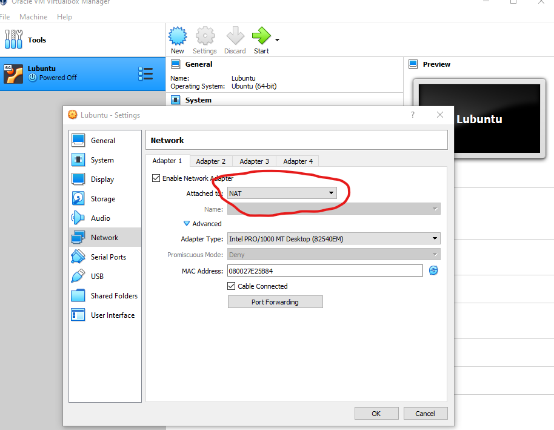
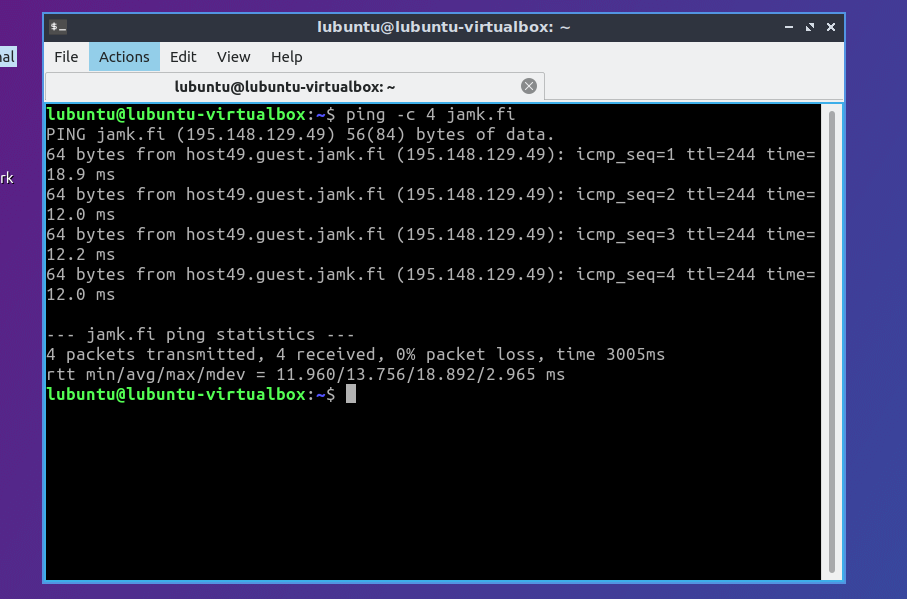
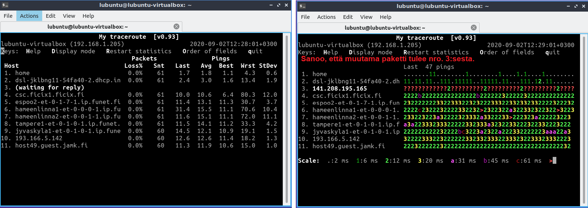
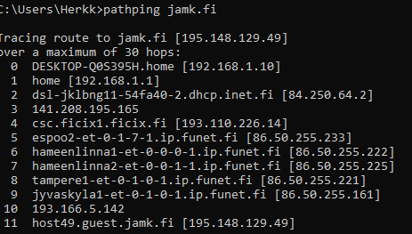

# Ensimmäiset virtuaalikoneet

Minun nimeni on Herkko Mehtälä ja opiskelijanumeroni on AA2958

* Mitä hyötyä virtuaalikoneista on?
	- Virtuaalikoneet mahdollistavat monen käyttöjärjestelmän ajamisen virtualisointitekniikan avulla.  
  - Ajaa riskialttiita ohjelmia huolimatta siitä, että se voisi korruptoida tai vahingoittaa isäntäkonetta.  

* Mitä voit tehdä sillä?
	- Voit ajaa monta käyttöjärjestelmää samasta koneesta jotka ovat eristäytyneet toisistaan. Tämä mahdollistaa esim: hiekkalaatikkoympäristön jossa on mahdollista testata ohjelmia, konfigurointia ja muuta ilman, että tämä haittaisi isäntäkonetta.  

* Onko tietokoneissa mitään pointtia ilman verkkoyhteyttä?
	- Kyllä. Tällä voidaan esim.: Turvata järjestelmä internetistä tulevilta uhilta tai käsitellä tiedostoja tai tietokantoja jotka eivät missään nimessä voi vuotaa ulkopuolelle.

## Virtuaalikoneen dokumentointi
	
[1]. Vaihdetaan virtuaalikoneen verkkoasetukset NAT (Network address translation) moodiin jotta saadaan toimiva
internet yhteys.(Kuva 1)  

  

[2]. Testataan virtuaalikoneen internet yhteys käyttämällä 'ping' komentoa. Käyttämällä parametriä '-c 4' lähetämme
vain 4 ECHO_REQUEST pakettia ('man ping' kertoo kaikki parametrit, kuva 2).

  

```
lubuntu@lubuntu-virtualbox:~$ ping -c 4 jamk.fi  
PING jamk.fi (195.148.129.49) 56(84) bytes of data.  
64 bytes from host49.guest.jamk.fi (195.148.129.49): icmp_seq=1 ttl=244 time=18.9 ms  
64 bytes from host49.guest.jamk.fi (195.148.129.49): icmp_seq=2 ttl=244 time=12.0 ms  
64 bytes from host49.guest.jamk.fi (195.148.129.49): icmp_seq=3 ttl=244 time=12.2 ms  
64 bytes from host49.guest.jamk.fi (195.148.129.49): icmp_seq=4 ttl=244 time=12.0 ms  

--- jamk.fi ping statistics ---  
4 packets transmitted, 4 received, 0% packet loss, time 3005ms  
rtt min/avg/max/mdev = 11.960/13.756/18.892/2.965 ms  
```  

[3]. Testataan 'traceroute' komentoa. Tulokset olivat hajanaiset, joten vaihdoin verkkoasetukset 'bridged' moodiin.

```
lubuntu@lubuntu-virtualbox:~$ traceroute jamk.fi  
traceroute to jamk.fi (195.148.129.49), 64 hops max  
  1   192.168.1.1  3,003ms  1,433ms  1,281ms  
  2   84.250.64.2  3,090ms  1,871ms  2,435ms  
  3   *  141.208.195.165  177,099ms  102,986ms   
  4   193.110.226.14  6,925ms  6,734ms  6,712ms  
  5   86.50.255.233  12,977ms  11,587ms  12,254ms  
  6   86.50.255.222  11,490ms  11,020ms  16,985ms  
  7   86.50.255.225  11,550ms  20,414ms  14,251ms  
  8   86.50.255.221  13,216ms  12,068ms  11,474ms  
  9   86.50.255.161  29,707ms  20,728ms  11,113ms  
 10   193.166.5.142  12,108ms  11,354ms  15,807ms  
 11   195.148.129.49  10,970ms  10,631ms  10,808ms  
```
 
Suoritin komennon monta kertaa ja jonkin takia jokainen nro. 3 hop jäi viivyttelemään tai ei päässyt perille ollenkaan. En ole varma miksi näin on. Lisä testaus voisi auttaa paljastamaan tämän vian.

Kokeillaan tracerouten '--resolve-hostnames' parametria:  

```
lubuntu@lubuntu-virtualbox:~$ traceroute --resolve-hostnames jamk.fi  
traceroute to jamk.fi (195.148.129.49), 64 hops max  
  1   192.168.1.1 (home)  1,168ms  1,209ms  0,841ms  
  2   84.250.64.2 (dsl-jklbng11-54fa40-2.dhcp.inet.fi)  1,729ms  1,953ms  1,301ms  
  3   *  *  *  
  4   193.110.226.14 (csc.ficix1.ficix.fi)  7,139ms  6,923ms  6,835ms  
  5   86.50.255.233 (espoo2-et-0-1-7-1.ip.funet.fi)  11,546ms  11,578ms  11,471ms  
  6   86.50.255.222 (hameenlinna1-et-0-0-0-1.ip.funet.fi)  11,412ms  11,746ms  11,773ms  
  7   86.50.255.225 (hameenlinna2-et-0-0-1-1.ip.funet.fi)  11,652ms  11,893ms  11,488ms  
  8   86.50.255.221 (tampere1-et-0-1-0-1.ip.funet.fi)  12,504ms  14,214ms  12,910ms   
  9   86.50.255.161 (jyvaskyla1-et-0-1-0-1.ip.funet.fi)  12,428ms  16,620ms  12,405ms  
 10   193.166.5.142 (193.166.5.142)  11,684ms  16,449ms  11,709ms  
 11   195.148.129.49 (host49.guest.jamk.fi)  11,905ms  11,056ms  10,894ms  
```  

Kuten huomataan, nro. 3 hop ei saatu yhteyttä. Koitin vielä käyttää 'ping' komentoa IP osoitteeseen '141.208.195.165'
mutta en saanut mitään takaisin. Host alhaalla?
 
[4] Testataan vielä MyTraceRoute 'mtr' komentoa. Tämä on kuin ping ja tracerouten yhdistelmä. Ohjelmassa on
monta display moodia jotka auttavat hahmottamaan dataa. (Kuva 3)

  


Windowsin oma mtr:än vastainen ohjelma on 'pathping'. (Kuva 4)  

  