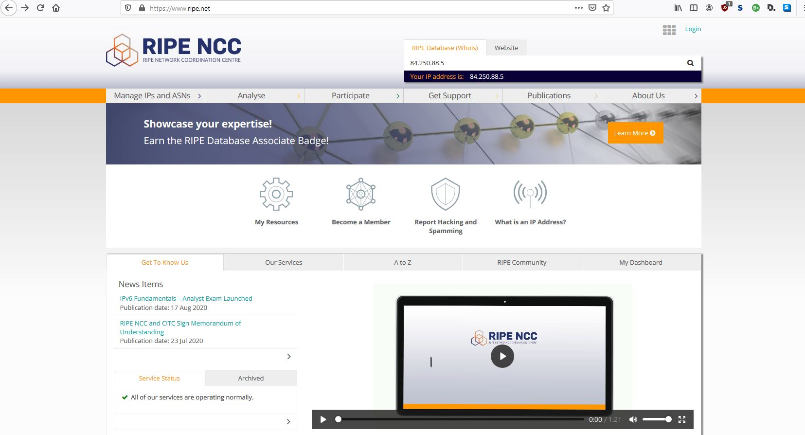
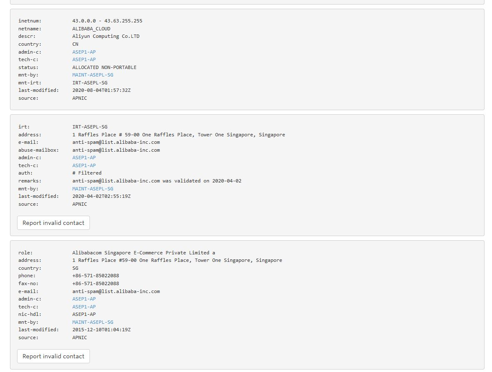
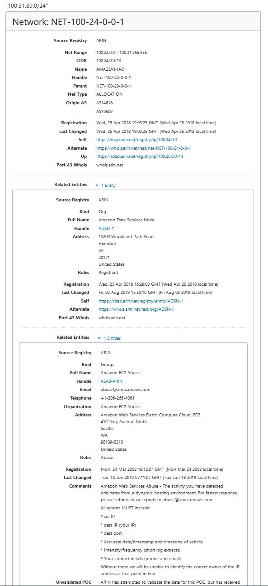

# Aliverkkojen laskeminen

+ Opiskelijanumeroni: 2003189  
+ Muotoilu: vvxyzki  
+ 192.168.89.0/24  
+ 10.3.31.0/24 

## Exercise 01  
What is the usable address range of 192.168.ki.0/24? What is the broadcast address? What is the network address?  
+ Usable address range: 256 - 2 = 254  
+ Broadcast address: 192.168.89.255  
+ Network address: 192.168.89.0  

## Exercise 02
Divide the 192.168.89.0/24 into smaller subnets with (atleast) 50 hosts in each.  

| Specification                        	| Original subnet info 	| Divided subnet info 	| Divided subnet info 	| Divided subnet info 	| Divided subnet info 	|
|--------------------------------------	|----------------------	|---------------------	|---------------------	|---------------------	|---------------------	|
| New subnet mask                      	| 255.255.255.0        	| 255.255.255.192     	| 255.255.255.192     	| 255.255.255.192     	| 255.255.255.192     	|
| Number of usable hosts in the subnet 	| 256 - 2 = 254        	| 64 - 2 = 62         	| 64 - 2 = 62         	| 64 - 2 = 62         	| 64 - 2 = 62         	|
| Network address                      	| 192.168.89.0/24      	| 192.168.89.0/26     	| 192.168.89.64/26    	| 192.168.89.128/26   	| 192.168.89.192/26   	|
| First IP host address                	| 192.168.89.1         	| 192.168.89.1        	| 192.168.89.65       	| 192.168.89.129      	| 192.168.89.193      	|
| Last IP host address                 	| 192.168.89.254       	| 192.168.89.62       	| 192.168.89.126      	| 192.168.89.190      	| 192.168.89.254      	|
| Broadcast address                    	| 192.168.89.255       	| 192.168.89.63       	| 192.168.89.127      	| 192.168.89.191      	| 192.168.89.255      	|  
  
## Exercise 03
Divide the 10.3.31.0/24 into smaller subnets with (atleast) 13 hosts in each.  

| Specification                    	| Original subnet info 	| Divided subnet info 	| Divided subnet info 	| Divided subnet info 	| Divided subnet info 	| Divided subnet info 	|
|----------------------------------	|----------------------	|---------------------	|---------------------	|---------------------	|---------------------	|---------------------	|
| New subnet mask                  	| 255.255.255.0        	| 255.255.255.224     	| 255.255.255.224     	| 255.255.255.224     	| 255.255.255.224     	| 255.255.255.224     	|
| Number of usable hosts in subnet 	| 256 - 2 = 254        	| 32 - 2 = 30         	| 32 - 2 = 30         	| 32 - 2 = 30         	| 32 - 2 = 30         	| 32 - 2 = 30         	|
| network address                  	| 10.3.31.0            	| 10.3.31.0           	| 10.3.31.32          	| 10.3.31.64          	| 10.3.31.96          	| 10.3.31.128         	|
| First IP host address            	| 10.3.31.1            	| 10.3.31.1           	| 10.3.31.33          	| 10.3.31.65          	| 10.3.31.97          	| 10.3.31.129         	|
| Last IP host address             	| 10.3.31.254          	| 10.3.31.30          	| 10.3.31.62          	| 10.3.31.94          	| 10.3.31.126         	| 10.3.31.158         	|
| Broadcast address                	| 10.3.31.255          	| 10.3.31.31          	| 10.3.31.63          	| 10.3.31.95          	| 10.3.31.127         	| 10.3.31.159         	|

## Exercise 04
Divide the last 13 host subnet into smaller subnets with (atleast) 2 hosts in each.  

| Specification                    	| Original subnet info 	| Divided subnet info 	| Divided subnet info 	| Divided subnet info 	| Divided subnet info 	|
|----------------------------------	|----------------------	|---------------------	|---------------------	|---------------------	|---------------------	|
| New subnet mask                  	| 255.255.255.224      	| 255.255.255.252     	| 255.255.255.252     	| 255.255.255.252     	| 255.255.255.252     	|
| Number of usable hosts in subnet 	| 32 - 2 = 30          	| 4 - 2 = 2           	| 4 - 2 = 2           	| 4 - 2 = 2           	| 4 - 2 = 2           	|
| network address                  	| 10.3.31.128          	| 10.3.31.128         	| 10.3.31.132         	| 10.3.31.136         	| 10.3.31.140         	|
| First IP host address            	| 10.3.31.129          	| 10.3.31.129         	| 10.3.31.133         	| 10.3.31.137         	| 10.3.31.141         	|
| Last IP host address             	| 10.3.31.158          	| 10.3.31.130         	| 10.3.31.134         	| 10.3.31.138         	| 10.3.31.142         	|
| Broadcast address                	| 10.3.31.159          	| 10.3.31.131         	| 10.3.31.135         	| 10.3.31.139         	| 10.3.31.143         	| 

## Exercise 05
Is 10.3.31.0/24 a part of 10.3.16.0/16? Write your calculations on paper or do them on the computer. Add the calculations to the documentation (e.g. take a picture of the paper or screenshot).  

10.3.16.0/16 range = 10.3.0.0 - 10.3.255.255  
10.3.31.0/24 is in range of 10.3.16.0/16  

## Exercise 06
Is 10.3.31.0/24 a part of 10.0.0.0/8? Write your calculations on paper or do them on the computer. Add the calculations to the documentation (e.g. take a picture of the paper or screenshot).  

  

10.0.0.0/8 range = 10.0.0.0 - 10.255.255.255  
10.3.31.0/24 is in range of 10.0.0.0/8  

## Looking up addresses
  

  

My IP address belongs to inetnum group of 84.250.0.0 - 84.251.255.255.  
inetnum specifies a range of IPv4 addresses that the inetnum object presents.  
 
the netname given for this range is "SONERA-FINLAND-BBNET" which suggests that it is being used by Telia Sonera  
The "descr" confirms this, as it says that it's being operated by "TeliaSonera Finland Oyj".  

## Internet Registries
Search for 195.3.31.0/24, 43.3.89.0/24, 15.89.3.0/24 and 100.31.89.0/24  
Who are they registered to? Search through the RIRs:  

+ 195.3.31.0/24  
Plugging this in RIPE, I get the following results:  

  

It seems that it's allocated and is being used by RIPE itself. However, looking at the bottom the "descr" tells that it's been used by LDCOM Networks. I assume things in the bottom section are old information since it's been last modified in 2005 and LDCOM networks went defunct in 2009...  

+ 43.3.89.0/24  
This IP address belongs under APNIC. 

  

It says that this IP belongs to a group owned by Alibaba Cloud which is a chinese cloud computing company. However, looking more through the list we can see that the "address" is located in Singapore. This makes more sense when you know that Alibaba group's headquaters are located in Singapore.  

+ 15.89.3.0/24
This IP address belong under ARIN.  

  

The site tells us that the IP address belongs to range 15.0.0.0 - 15.103.255.255 which has been given to Hewlett-Packard. That's a weird thing to find out when you're doing this research on HP laptop...  

+ 100.31.89.0/24  
This one aswell belongs under ARIN.  

  

The IP address belongs to a range of 100.24.0.0 - 100.31.255.255 and is being operated by AMAZON. Full name gives us Amazon data services 'NoVa'. Only thing I could find about Amazon NoVa was an article about Northern Virginia Community College (NOVA) being in collaboration with Amazon Web Services (AWS) Educate program. The time frame would match as this was announced in June 2018 and the IP was reserved in April 2018.  
https://aws.amazon.com/blogs/publicsector/major-in-the-cloud-nova-and-aws-announce-first-cloud-computing-degree/  

 

  

