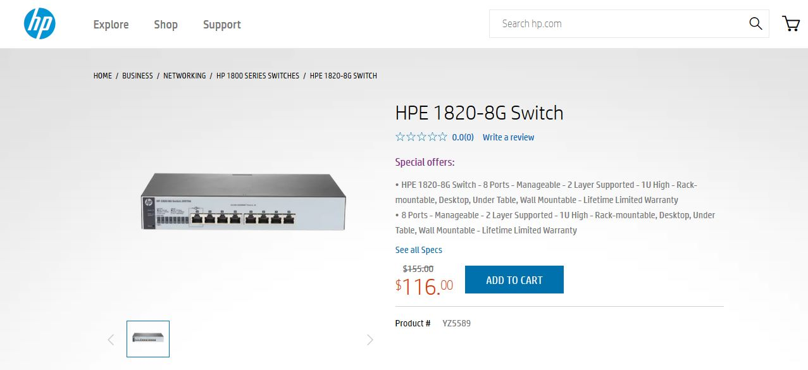
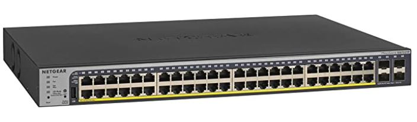
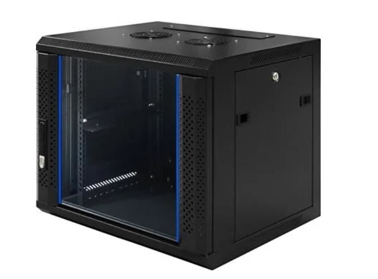
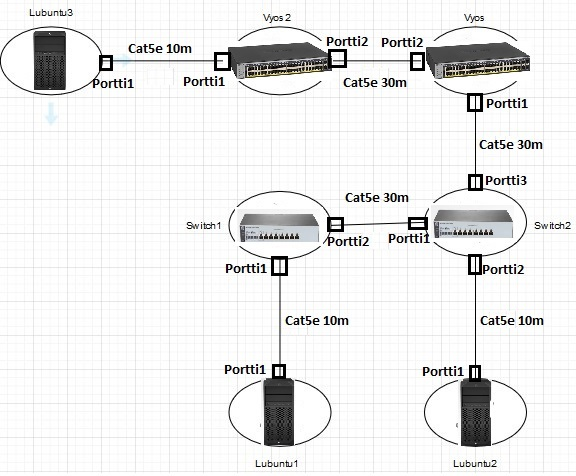

# Fyysinen harjoite

Aloitan katsomalla verkon fyysistä topologiaa ja listaamalla tarvittavat laitteet ja kaapelit ensin.  

  

Tästä nähdään, että tarvitsen ainakin:  
- 2 Kykintä  
- 2 Reititintä  
- 3 Työasemaa  
- Ainakin 6 eri kaapelia kytkemään laitteet toisiinsa  

## Laitteet

Toimiva kytkin meidän tarkoitukseen on: HPE 1820-8G Switch [Linkki HP:n sivuille](https://buy.hpe.com/us/en/networking/switches/fixed-port-web-managed-ethernet-switches/1800-switch-products/hpe-officeconnect-1820-switch-series/hpe-officeconnect-1820-8g-switch/p/J9979A)  

  

Tärkeät tiedot ovat:  
- 8 RJ-45 10/100/1000 porttia  
- Ulottuvuudet ovat: (metric)25.4 x 15.95 x 4.39 cm, (imperial)10 x 6.28 x 1.73 in  
- Paino: 0,82kg  
- Maksaa noin 120€/kpl  

Seuraavaksi reititin meidän tarkoitukseen on: NETGEAR GS752TP [Linkki netgear sivulle](https://www.netgear.com/business/products/switches/smart/GS752TP.aspx#tab-techspecs)  

  

Tärkeät tiedot ovat:  
- 48 RJ-45 Gigabit porttia koska miksi ei  
- Ulottuvuudet ovat: 440 x 316 x 43 mm  
- Paino: 5,1kg  
- Maksaa noin 440€/kpl  

Tarvitsen vielä työaseman joka tulee olemaan: HP Z2 G4 Workstation [Linkki kaupan sivuille](https://www.atea.fi/eshop/product/hp-workstation-z2-g4/?prodid=2740267)  

  

Tärkeät tiedot ovat:  
- Intel I350-T2 Verkkosovitin jossa 2 RJ-45 porttia
- Ulkomitat (PxSxK) 16.9 cm x 43.5 cm x 35.6 cm  
- Paino: 7kg  
- Maksaa noin 993,63€/kpl  

Kaikki laitteet tukevat RJ-45 liitintä, joten kuparikaapeleilla mennään. Tehtävänannossa ei ole kerrottu, että ympäristössä olisi elektromagneettista häirintää, joten kaapelien suojaus ei ole välttämätöntä.  

Verkkolaitteiden väliset yhteydet tehdään 30m CAT5e F/UTP verkkokaapeleilla. [Linkki kaupan sivuille](https://www.verkkokauppa.com/fi/product/7086/ckmq/InLine-CAT5e-F-UTP-verkkokaapeli-30-m-harmaa?list=OZCYkRVZDcHKDiSKG)  
Tärkeät tiedot ovat:  
- 30m pitkä  
- CAT5e luokka  
- RJ45 liitin  
- F/UTP suojauksella  
- Maksaa 28,99€/kpl  

Tämän lisäksi päätelaitteiden ja verkkolaitteiden välinen yhteys tehdään 10m CAT5e U/UTP verkkokaapeleilla. [Linkki kaupan sivuille](https://www.verkkokauppa.com/fi/product/9682/rhsg/Goobay-CAT5e-U-UTP-verkkokaapeli-10-m-valkoinen?list=OZCYkRCTgSEVLGyOKnUiEKnUZDVieJ85YAU9Vbem5Zq9X1NctKwVVT1vKRPGEKRD92Z)  
Tärkeät tiedot ovat:  
- 10m pitkä  
- CAT5e luokka  
- RJ45 liitin  
- U/UTP suojaus  
- Maksaa 10,99€/kpl  

Jokainen verkkolaite tulee olemaan laitetelineen tai kaapin sisällä lukittuna. Koska verkkolaitteita ei ole paljoa, pieni seinäkaappi käy. Käytän tässä tilanteessa Toten WM 6409 9U seinäkaappia. [Linkki kaupan sivuille](https://www.verkkokauppa.com/fi/product/3149/cthsg/Toten-WM-6409-9U-450-mm-seinakaappi-lasiovella-musta?list=OZCYkRKItwgNVxyvKNHCzKlFvHKbQnOC9isghVgkIZTUb3Z7x0ONVpMKNVSLnNVjyw9)  

  

Tärkeät tiedot ovat:  
- 9U kapasiteetti (19 tuuman standardi)  
- Kaapin ulottuvuudet ovat: 600 mm x 450 mm x 501 mm  
- Maksimi kuorma 60kg  
- Kaapelointi katosta tai pohjasta  
- Maksaa 174,90€/kpl  
Koska laitteita on vain yksi per kaappi, ylimääräisiä tuulettimia ei tarvita. [Linkki kaapin dokumentaatioon](http://www.helptechco.com/files/pdf_files/WM.6415.9_PDF_0.pdf)  

Tästä syntyy kaikkien laitteiden yms. budjetti:  

| Laite                           	| Hinta yhteensä 	|
|---------------------------------	|----------------	|
| HPE 1820-8G Switch 2x           	| 240,0€         	|
| Netgear GS752TP 2x              	| 880,0€         	|
| HP Z2 G4 Työasema 3x            	| 2980,89€       	|
| 30m CAT5e verkkokaapeli 3x      	| 86,97€         	|
| 10m CAT5e verkkokaapeli 3x      	| 32,97€         	|
| Toten WM 6409 9U Seinäkaappi 4x 	| 699,60€        	|  

Yhteensä nämä kaikki maksavat 4920,43€  

## Asennus

Kaikki verkkolaitteet tulevat omiin seinäkaappeihin. Virtajohdot ja ethernet kaapelit vedetään joko ylä- tai alapaneelista, riippuen miten seinäkaappi asennetaan. Ylimääräisiä tuulettimia ei tarvitse asentaa, koska laitteita on vain yksi per kaappi. Seinäkaapeissa tulee valmiina yksi alusta johon mahtuu 1U verkkolaite johon kyseinen verkkolaite asenntaan. [Täältä löydät seinäkaapin dokumentaation](http://www.helptechco.com/files/pdf_files/WM.6415.9_PDF_0.pdf)  
Työpisteiden ja verkkolaitteiden kaapelointi tapahtuu Cat5e ethernet kaapelilla joissa on RJ-45 liitin. Kaikki laitteet tukevat tätä liitintä, mukaanlukien työpisteet, joissa on Intel I350-T2 Verkkosovitin. Hyvin tarkat piirustus suunnitelman näet tästä:  

  

