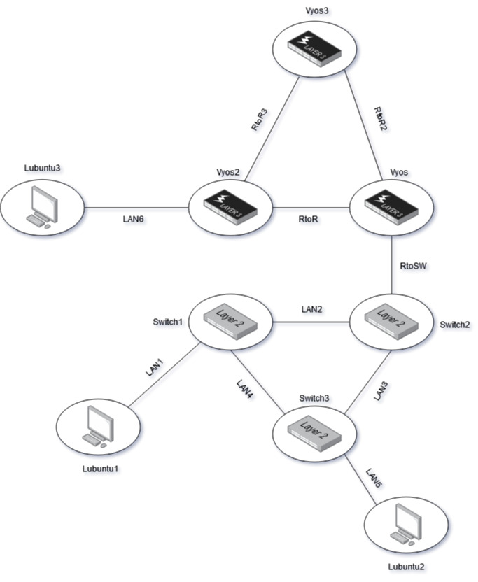
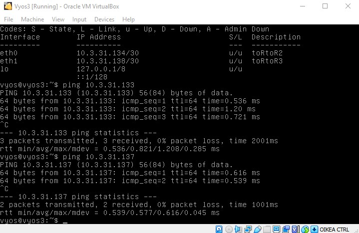
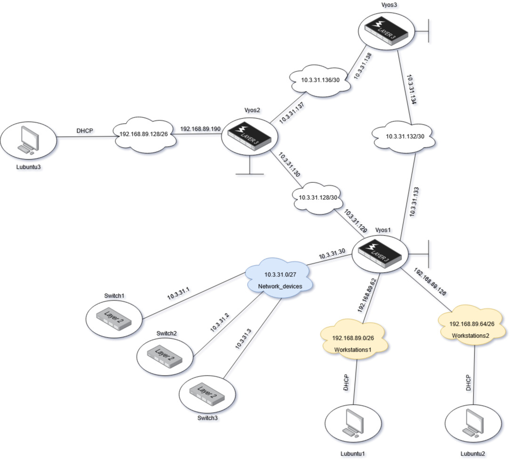
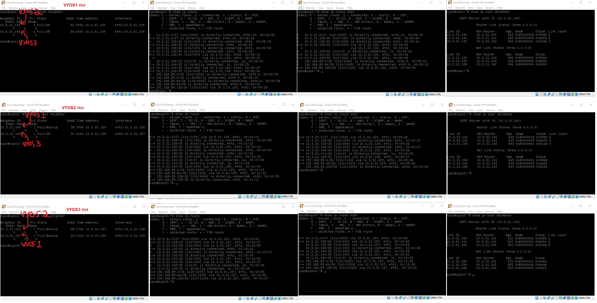
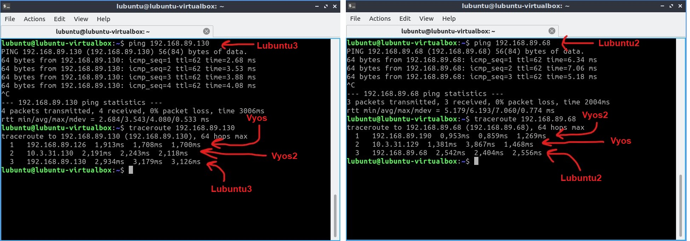
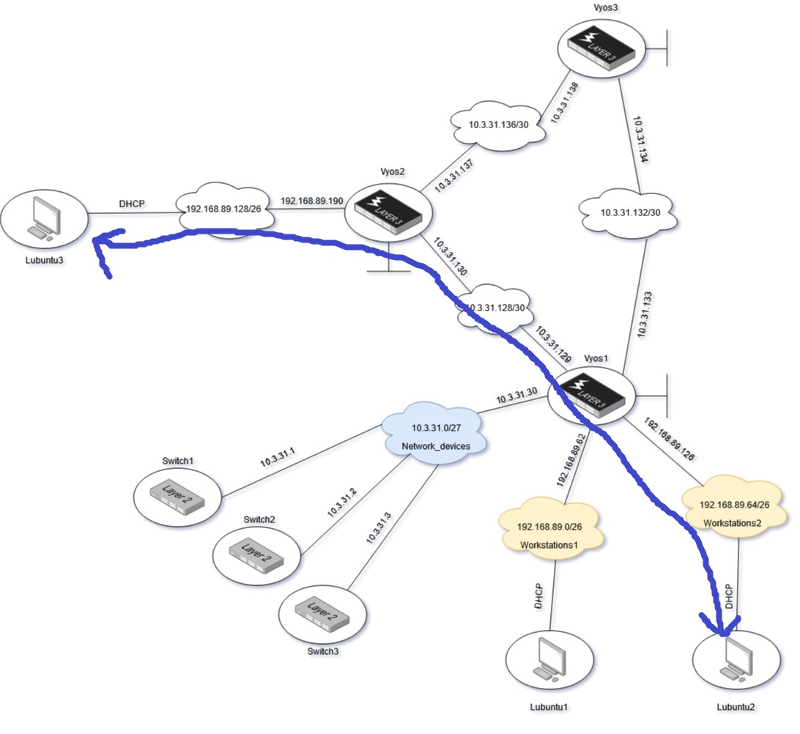

# OSPF

Aloitan kloonaamalla uuden vyos -kytkimen ja lisäämällä sen topologiaan tehtävänannon mukaisesti:  

  

Tämän jälkeen konfiguroin Vyos -reitittimet jonka jälkeen testaan toimivuutta pingillä:    

  

Toimii ongelmitta. Tämän jälkeen tarvitsen jokaiselle reitittimelle loopback osoitteen. Teen tämän jakamalla aliverkon `10.3.31.140/30` kolmeen osaan (Esim.: `10.3.31.140/32`) ja jakamalla kyseiset IP-osoitteet kytkimille komennolla: `set interfaces loopback lo address <x.x.x.x/32>`     
Tämän jälkeen verkon topologia näyttää tältä:  

  

## OSPF asentaminen

On aika asentaa OSPF dynaaminen reititys verkkoon. Ensin poistan edelliset staattiset reititykset kummaltakin reitittimeltä komennolla `delete protocols static route <x.x.x.x/xx>`. OSPF asennus toimii komennolla `set protocols ospf area 0 network <x.x.x.x/xx>` jossa IP-osoite on verkon osoite. Esimerkiksi Vyos1 tulee komento: `set protocols ospf area 0 network <10.3.31.128/30>`. Tämä komento tehdään jokaisen reitittimen rajapintaan johon OSPF protokolla tulee.  

Tässä on lista erilaisista OSPF komennoista ja niiden selitteitä:  

| Komento                                                            	| Selite                                                             	|
|--------------------------------------------------------------------	|--------------------------------------------------------------------	|
| set protocols ospf area 0 network <x.x.x.x/xx>						| Asentaa OSPF protokollan rajapintaan. IP-osoite on verkon osoite.	 	|
| set protocols ospf parameters router-id <x.x.x.x>						| Asentaa Router-ID manuaalisesti. IP-osoite on loopback osoite.   		|
| show ip ospf neighbor                                                	| Näyttää OSPF mukaisen naapuruston. Hyvä vian selvittämiseen  			|
| show ip route ospf													| Näyttää vakiintuneet reitit reititystaulukossa. Filtteröi esiin OSPF	|
| show ip ospf															| Näyttää OSPF asetukset laitteessa.									|
| show ip ospf interface												| Näyttää rajapintojen OSPF asetukset ja ominaisuudet.					|  

OSPF:n asennuksen jälkeen tarkistan, että kaikki toimii ongelmitta. Tarkistan konfigurointia edellisillä komennoilla:  

  

Kaikki näyttää hyvältä toistaiseksi, mutta mikään ei päihitä pingiä ja traceroutea. Pingaan ja tracerouttaan Lubuntu2:selta Lubuntu3:selle ja toisinpäin. Katsotaan jos pingi kulkee...  

  

Pingi rullaa ja traceroute on järkevän näköinen. Erinomaista! Traceroutesta näkee, että tietoliikenne mene Vyos1 ja Vyos2 väliltä. Tästä voi piirtää kartan jossa sininen viiva on reitti josta liikenne kulkee. **HUOM!** Oikeasti liikenne kulkisi Switch3 ja Switch2 kautta Vyos1:seen ja siitä eteenpäin, mutta tämä kuva on katsottuna Layer 3 -tasolta.    

  

