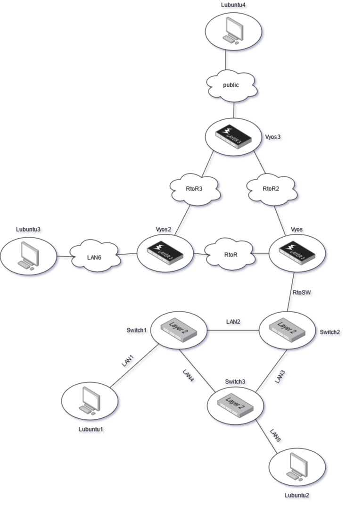
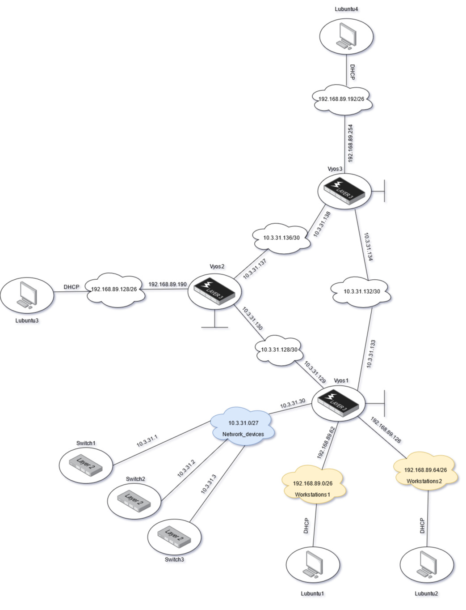
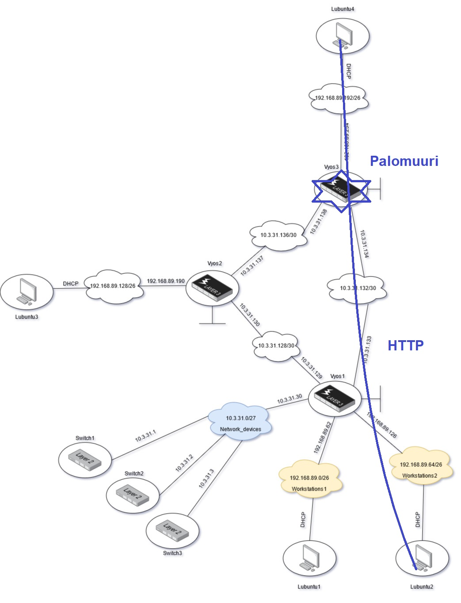
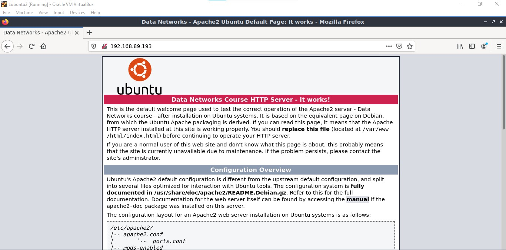
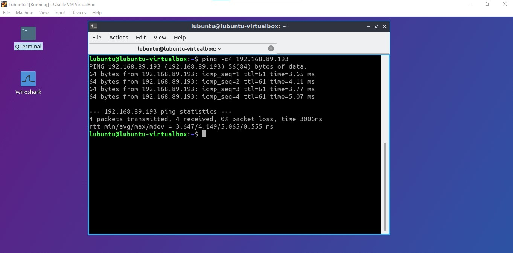
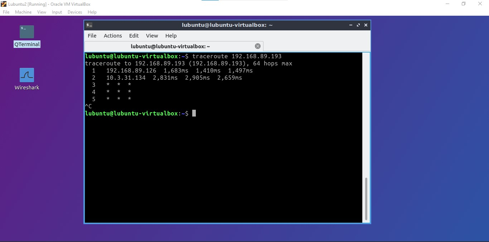
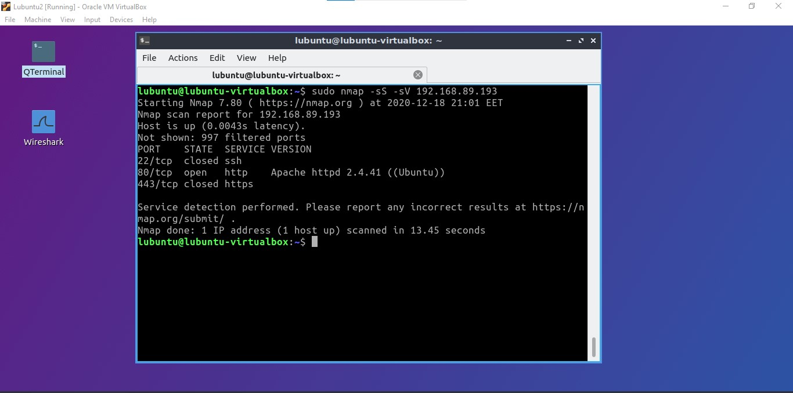
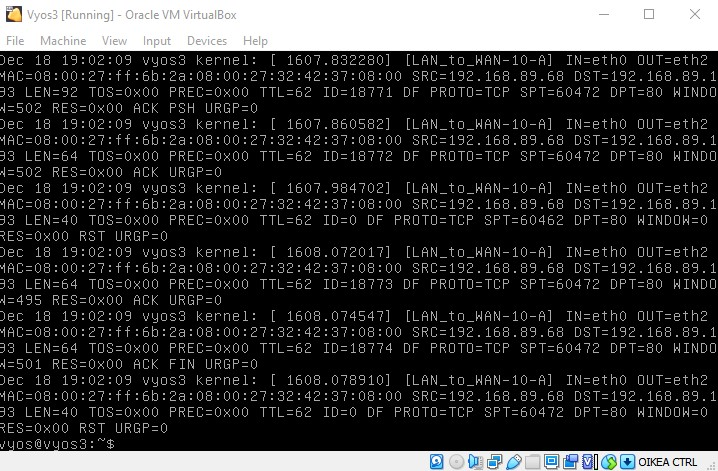

# Palomuuraaminen

Ensin kloonaan uuden työaseman ja asennan uuden adapterin Vyos3:seen. Uuden Lubuntun ja Vyos3 välinen internal network tulee 'public' -nimellä. Tämän verkon osoitteeksi tulee `192.168.89.192/26` ja oletusyhteyskäytävä on `192.168.89.254`.  

Asennan DHCP palvelimen vyos3:selle ja konfiguroin sen, jotta työasemat saavat IP-osoitteet. Tämän jälkeen lisään tämän verkon dynaamiseen reititykseen komennolla `set protocols ospf area 0 network <192.168.89.192/26>`.  
Tämän jälkeen verkkoni näyttää tältä fyysisen kytkennän näkokulmasta:  

  

Ja TCP/IP tai layer 3 näkökulmasta:  

  

Suunitelma on luoda 3 palomuuri zonea: *LAN*, *WAN* ja *Vyos*.  

  

## Palomuurien konfigurointi

On hyvä idea päästää kaikki pingit palomuureista läpi testausta varten. Tämä tehdään komennolla `set firewall all-ping <enable/disable>`.  

Nyt aloitan palumuurien zone luonnin. Zonet luodaan komennolla `set zone-policy zone <name> default-action <drop/accept>`.  

  

Tämän jälkeen pitää päättää mihin interfaceen kyseiset zonet kuuluvat. Tämä tehdään komennolla `set zone-policy zone <name> interface <interface>`.  
Tässä tapauksessa WAN zone tulee interface eth2, LAN zone tulee eth1 ja eth0. Vyos zone on local-zone.  

On aika konfiguroida LAN -> WAN palomuuri säännöt. Nämä ovat:  

```
set firewall name LAN_to_WAN default-action drop
set firewall name LAN_to_WAN enable-default-log
set firewall name LAN_to_WAN rule 10 action accept
set firewall name LAN_to_WAN rule 10 destination port 80
set firewall name LAN_to_WAN rule 10 protocol tcp
set firewall name LAN_to_WAN rule 10 log enable
set firewall name LAN_to_WAN rule 11 action accept
set firewall name LAN_to_WAN rule 11 destination port 443
set firewall name LAN_to_WAN rule 11 protocol tcp
set firewall name LAN_to_WAN rule 11 log enable
set firewall name LAN_to_WAN rule 20 action accept
set firewall name LAN_to_WAN rule 20 protocol icmp
set firewall name LAN_to_WAN rule 20 log enable
set firewall name LAN_to_WAN rule 30 action accept
set firewall name LAN_to_WAN rule 30 destination port 22
set firewall name LAN_to_WAN rule 30 protocol tcp
set firewall name LAN_to_WAN rule 30 log enable
set firewall name LAN_to_WAN rule 40 action accept
set firewall name LAN_to_WAN rule 40 destination port 53
set firewall name LAN_to_WAN rule 40 protocol udp
set firewall name LAN_to_WAN rule 40 log enable
```

Tämän jälkeen luon WAN -> LAN säännöt. Haluan, että palomuuri päästää kaikki olemassa olevat yhteydet takaisin LAN:iin. Tämä tehdään `stateful` asetuksella:  

```
set firewall name WAN_to_LAN default-action drop
set firewall name WAN_to_LAN rule 10 action accept
set firewall name WAN_to_LAN rule 10 state established enable
set firewall name WAN_to_LAN rule 10 state related enable
```

Tarvitsen säännöt LAN -> Vyos yhteyksille. Nämä ovat SSH yhteyksiä joten hyväksyn ne. Tämän lisäksi dynaaminen reititysprotokolla OSPF tarvitsee hyväksymisen. Säännöt näille ovat:  

```
set firewall name LAN_to_vyos default-action drop
set firewall name LAN_to_vyos rule 10 action accept
set firewall name LAN_to_vyos rule 10 destination port 22
set firewall name LAN_to_vyos rule 10 protocol tcp
set firewall name LAN_to_vyos rule 20 action accept
set firewall name LAN_to_vyos rule 20 protocol ospf
```

Edellisen lisäksi tarvitsen yhteyden Vyos -> LAN. SSH ja OSPF pitää otta huomioon myös. Säännöt tähän ovat:  

```
set firewall name vyos_to_LAN default-action drop
set firewall name vyos_to_LAN rule 10 action accept
set firewall name vyos_to_LAN rule 10 state established enable
set firewall name vyos_to_LAN rule 10 state related enable
set firewall name vyos_to_LAN rule 20 action accept
set firewall name vyos_to_LAN rule 20 protocol ospf
```

Viimeisenä on mahdollisuus laittaa Vyos -> WAN ja toisinpäin, mutta koska tällä simuloidaan ínternettiä, en halua ulkopuolisten pääsevän käsiksi Vyossiin. Tästä syystä en anna WAN:ista tulevien yhteyksien pääsevän Vyossiin käsiksi.  

### Palomuurisääntöjen bindaus zoneihin

Palomuurisääntöjen bindaus zoneihin joita olen tehnyt tehdään komennolla `set zone-policy zone <destination-zone> from <source-zone> firewall name <source_to_destination>`  

Tässä tapauksessa nämä komennot ovat:  

```
set zone-policy zone LAN from WAN firewall name WAN_to_LAN
set zone-policy zone WAN from LAN firewall name LAN_to_WAN
set zone-policy zone vyos from LAN firewall name LAN_to_vyos
set zone-policy zone LAN from vyos firewall name vyos_to_LAN
```

Nyt palomuurien zonet ja niiden säännöt ovat tehty. Aika testata ne!  

### Palomuurin testaus

Testaan HTTP:n toimivuutta LAN -> WAN suunnassa. Lubuntu2 ottaa HTTP yhteyden Lubuntu4 HTTP palvelimeen. Tämä pitäisi läpäistä palomuurin LAN -> WAN sääntöjen mukaan. Katsotaan miten käy.  

  

  

HTTP LAN -> WAN näyttää toimivan!  

HTTP yhteyksien lisäksi ping/ICMP pitäisi toimia samalla tavalla. Kokeillaan...  

  

Ping rullaa myös. Varmistan tämän traceroutella. Katsotaan tracerouten tulos...  

  

Traceroute ei toimi. Tämä johtuu siitä, että traceroute toimii oletuksena UDP protokollan kautta. Tämä ei ole sallittu palomuurisäännöissä. lisäämällä vipun `--icmp` traceroute toimii ICMP protokollalla. Kokeillaan uudestaan...  

  

Traceroute toimii taas! Tämä varmistaa, että UDP ei läpäise LAN -> WAN suunnassa palomuuria. Erinomaista!  

Nmap on tietoverkkojen skannaus -ja testaus ohjelma. Käytän sitä minun palomuurin testauksessa. 

  

Nmap tuloksesta näen, että SSH ja HTTPS on 'closed', eli palomuuri estää niiden toimimisen LAN -> WAN suuntaan. HTTP protokolla toimii silti portissa 80. Tämä käy järkeen, sillä nämä ovat ne säännöt joita asetin palomuuriini.  Tämä varmentaa, että palomuurini toimii ongelmitta!  

Tässä on hyväksyttyjä tcp/80 paketteja jotka ovat HTTP paketteja. Nämä ovat hyväksytty palomuurissa joten ne läpäisivät palomuurin:  

  

Viimeisenä on default dropped paketit. Kuvasta näkee, että näitä on useita:  

  

### .cfg tiedostot

[Vyos3 .cfg file](E09/vyos3.cfg)  


