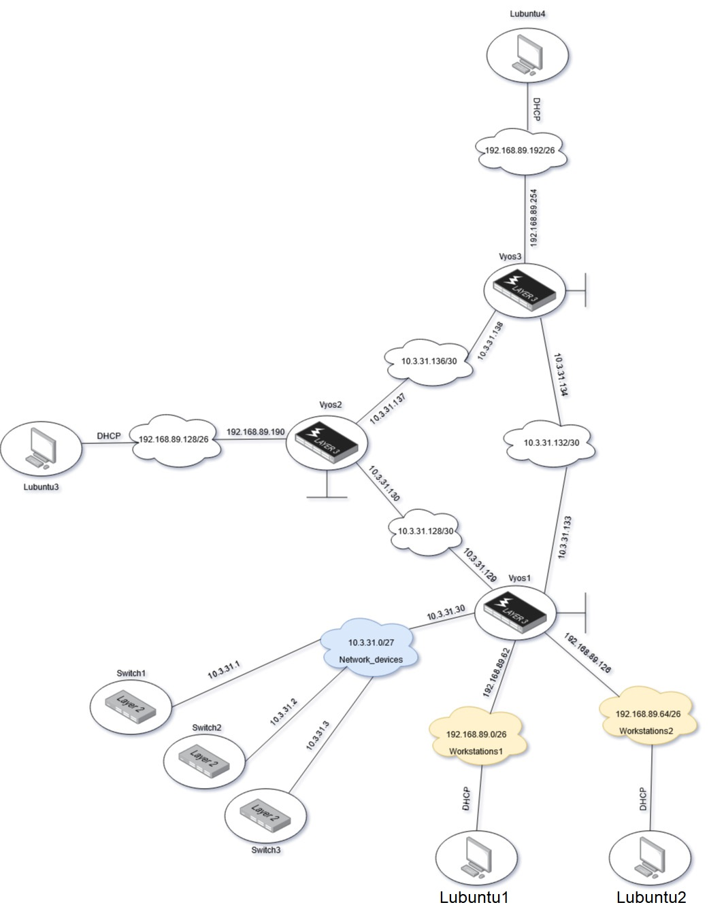
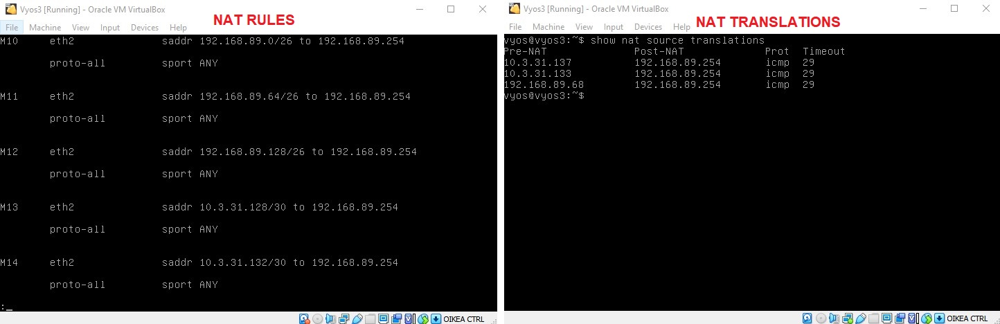
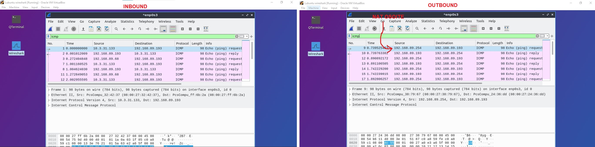

# NAT

Ensin kloonaan uuden työaseman ja asennan uuden adapterin Vyos3:seen. Uuden Lubuntun ja Vyos3 välinen internal network tulee 'public' -nimellä. Tämän verkon osoitteeksi tulee `192.168.89.192/26` ja oletusyhteyskäytävä on `192.168.89.254`.  

  
  

Asennan DHCP palvelimen vyos3:selle ja konfiguroin sen, jotta verkossa olevat laitteet saavat IP-osoitteet. Tämän jälkeen lisään tämän verkon dynaamiseen reititykseen komennolla `set protocols ospf area 0 network <192.168.89.192/26>`.  

Testaan verkon toimivuutta pingillä ja traceroutella:  

  

Kaikki näyttää toimivan oikein!

## Many-to-1 NAT asennus

Tarvitsen kaikki privaatti IPv4 osoitteet ennen kuin aloitan NATin asennuksen. Jokainen aliverkko jota verkossani on, tulee NAT:ittaa.    

Asennan NATin Vyos3:selle komennolla `set nat source rule 10 outbound-interface eth2`. eth2 osoittaa 'public' -verkkoa päin. Tämän jälkeen käytän komentoa `set nat source rule 10 translation address masquerade` joka maskeeraa tulevat IP-osoitteet NAT:in mukaisesti.  
Kaikki aliverkot tullaan NAT:ittamaan, paitsi `network_devices`, koska näillä ei ole asiaa julkiseen verkkoon. Tämän jälkeen lisään IP-osoitteet, jotka maskeerataan. Nämä IP-osoitteet ovat:  

| Aliverkko         	|
|-------------------	|
| 192.168.89.0/26   	|
| 192.168.89.64/26  	|
| 192.168.89.128/26 	|
| 10.3.31.128/30    	|
| 10.3.31.132/30    	|
| 10.3.31.136/30    	|  

Komennolla `set nat source rule 10 source address <xx.xx.xx.xx/xx>` lisään IP-osoitteet NAT:attavaksi. `source` viittaa tässä IPv4 otsikkoa jossa sen `source` -kenttä muutetaan.  

## NAT testaus

Aloitan testauksen perus pingillä ja traceroutella, jotta yhteys edes toimii.  
 
  

Yhteys toimii vieläkin. Tutkin Vyos3:sen sääntöjä ja käännöksiä, jotta IP-osoitteet on NAT:attu oikein.  

  

Näyttää siltä, että IP-osoitteet on NAT:itettu, mutta aion vielä testata tätä Wiresharkilla. Laitan Wiresharkin kuuntelemaan Vyos3:sen inbound ja outbound rajapintaan ja katson, mitä löydän.  

  

Kuten wiresharkista näkee, sisään tulee muutama eri IP-osoitetta `public` -verkkoa päin. Outbound kuvasta näen, että nämä IP-osoitteet on NAT:attu osoitteeseen `192.168.89.254` kuten pitääkin. Kaikki toimii ongelmitta!  

## NAT konfigure dumppi

```
vyos@vyos3# show nat source rule 
 rule 10 {
     outbound-interface eth2
     source {
         address 192.168.89.0/26
     }
     translation {
         address masquerade
     }
 }
 rule 11 {
     outbound-interface eth2
     source {
         address 192.168.89.64/26
     }
     translation {
         address masquerade
     }
 }
 rule 12 {
     outbound-interface eth2
     source {
         address 192.168.89.128/26
     }
     translation {
         address masquerade
     }
 }
 rule 13 {
     outbound-interface eth2
     source {
         address 10.3.31.128/30
     }
     translation {
         address masquerade
     }
 }
 rule 14 {
     outbound-interface eth2
     source {
         address 10.3.31.132/30
     }
     translation {
         address masquerade
     }
 }
 rule 15 {
     outbound-interface eth2
     source {
         address 10.3.31.136/30
     }
     translation {
         address masquerade
     }
 }
```


