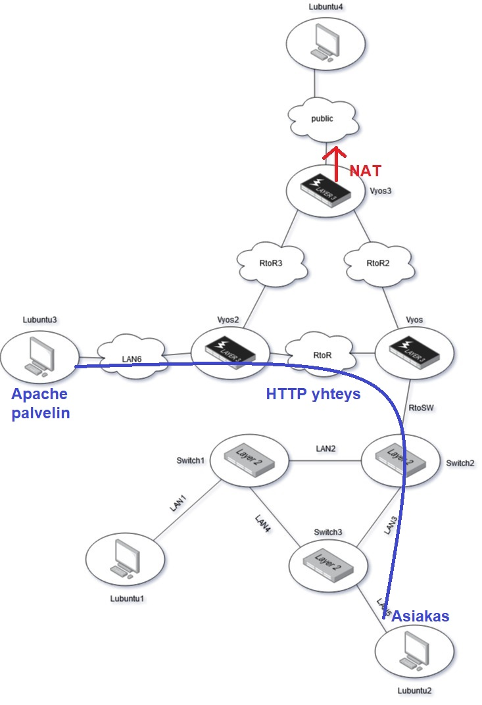
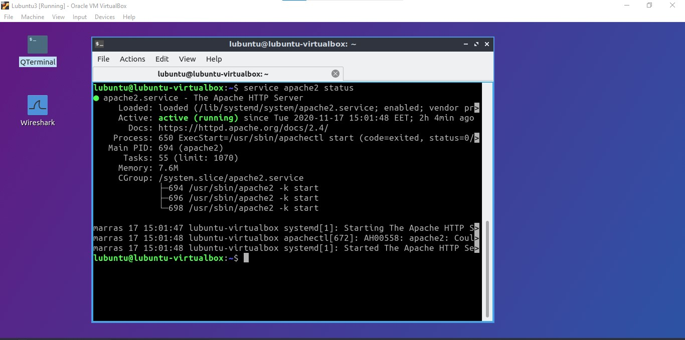
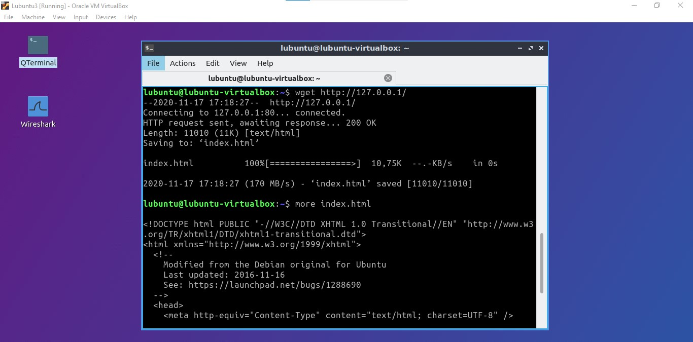
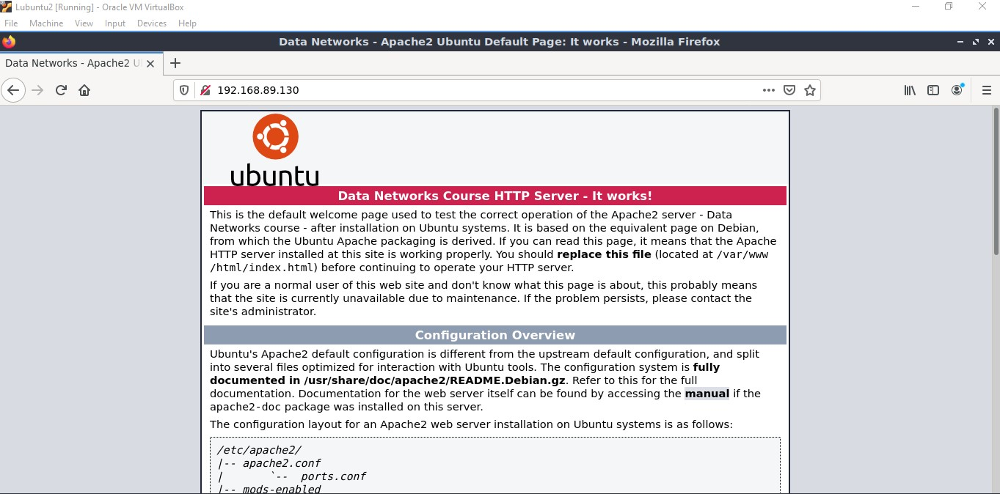
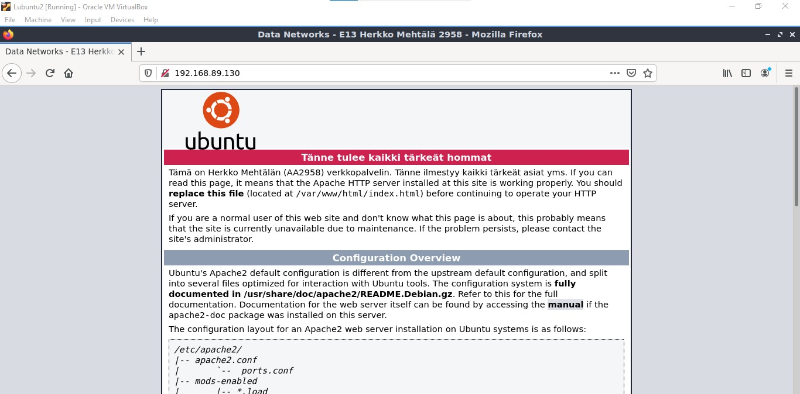
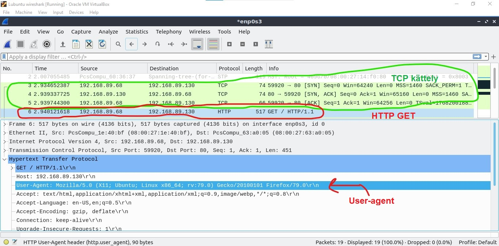

# Apache palvelin

Kuva nykyisestä verkosta ja mitkä koneet toimivat palvelimina ja asiakkaina:  

  

Varmistan, että Apache palvelin toimii Lubuntu3:sessa käyttämällä komentoa `service apache2 status`. 

  

Näyttää siltä, että palvelin pyörii ongelmitta. Tarkistan kuitenkin verkkopalvelimen index.html tiedoston wget komennolla ja syöttämällä sille oman loopback osoitteen. Tämä toimii komennolla: `wget http://127.0.0.1/`.  

  

`more` -komennolla näen mitä kyseisessä tiedostossa on. Tässä tapauksessa se on perus HTML tiedosto.  

Käyn vilkaisemassa miltä kyseinen index.html näyttää minun asiakas koneelta kun käytän verkkoselainta:  

  

Ei paha, mutta haluan omat verkkosivut tälle palvelimelle.

## Verkkopalvelimen konfigurointi

Muokkaan palvelimen index.html -tiedostoa käyttämällä nanoa. Komennolla `sudo nano /var/www/html/index.html` ja lisään sinne muutaman asian. Tämän jälkeen tallennan tiedoston.  

Kun uusi index.html on tehty, vierailen asiakas koneelta uuden HTTP -palvelimen etusivua:  

  

Erinomaista! HTTP palvelin näyttää toimivan ongelmitta.  

## HTTP:n wiresharkkailu

Lisään wireshark lubuntun asiakaskoneen verkkoon jolla nuuskin palvelimen ja asiakkaan välistä kommunikointia. Tämän jälkeen pyydän palvelimelta index.html tiedoston uudestaan ja katson mitä näen.  

  

Näen, että ensin palvelin ja asiakas muodostavat yhteyden TCP kättelyllä jonka jälkeen asiakas pyytää HTTP protokollalla palvelimen index.html tiedostoa. Tarkastelemalla pakettia näen, että paketissa sisältyy asiakkaan eri tietoja. Esimerkiksi `User-agent` kertoo asiakkaan verkkoselaimen, sen version ja käyttöjärjestelmän. Tässä tapauksessa se on mozilla verkkoselain. Käyttöjärjestelmä on hieman väärin, sillä minulla on käytössä Lubuntu. Tämä on ymmärrettävää, sillä Lubuntu on Ubuntun johdannainen käyttöjärjestelmä.

