# Ensimmäiset kytkimet

Ensiksi tuon kytkimen minun virtuaaliympäristöön ja kloonaan sen. Varmistan, että niiden verkko asetukset ovat kohdillaan.
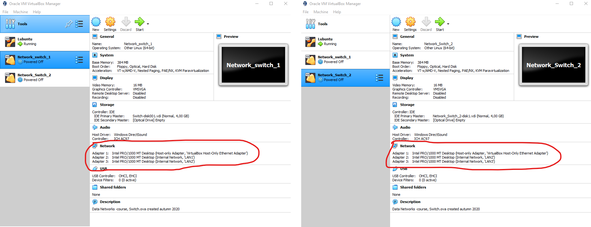
Samalla konfiguroin lubuntu1 verkkoasetukset adapter 1 -> LAN1 ja lubuntu2 adapter 1 -> LAN3

Lopulta minun verkkotopologia näyttää tältä:

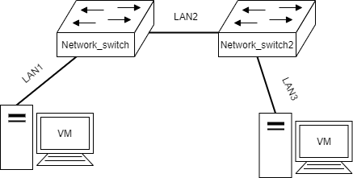

[Lähde: Karo Saharinen](https://datanetworks.pages.labranet.jamk.fi/ 'Linkki hänen sivulle') 

## Porttien tila

Käynnistän kytkimen ja kirjaudun sisään. Kytkimen terminaalin sisällä voin käyttää `show configuration` -komentoa joka näyttää laitteen konfiguroinnin. Voin myös nimetä laitteen uudelleen `configure snmp sysName <name>` -komennolla ja nimeän sen `Switch1`. Toinen kytkin nimetään `Switch2`.
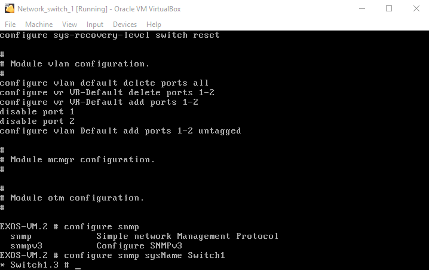

Seuraavaksi avaan kytkimistä portit. Tämä toimii komennolla `enable ports` ja määrittällä portit jotka avataan. Nyt avaan vain portit 1 ja 2. Voin tarkistaa porttien tilan komennolla `show ports # info`

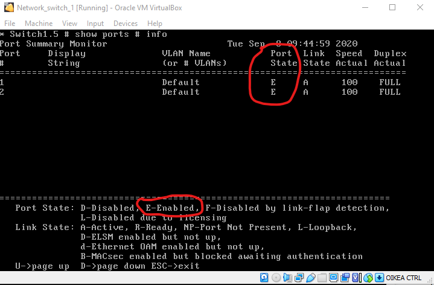

Tästä näen, että portit 1 ja 2 ovat aktiivisia. Tämä toistetaan kytkimelle *Switch2*

### Lubuntujen verkkoasetukset

Seuraavaksi muutan lubuntujen verkkoasetukset manuaalisesti. Navigoin `Edit connections...` osioon. Lisään manuaalisesti seuraavan IP-osoitteen ja aliverkkopeitteen:

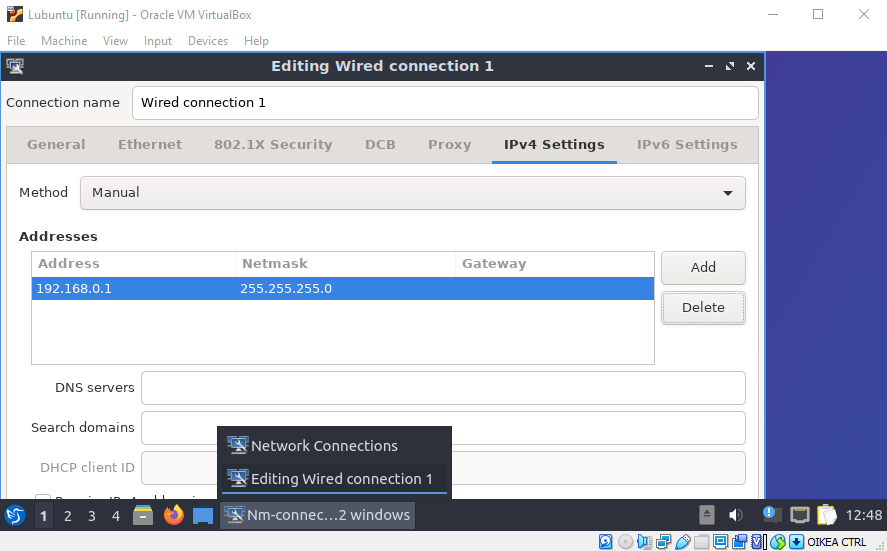

Tämän jälkeen voin tarkistaa lubuntun terminaalista, että asetukset ovat asettuneet oikein komennolla `ip addr`

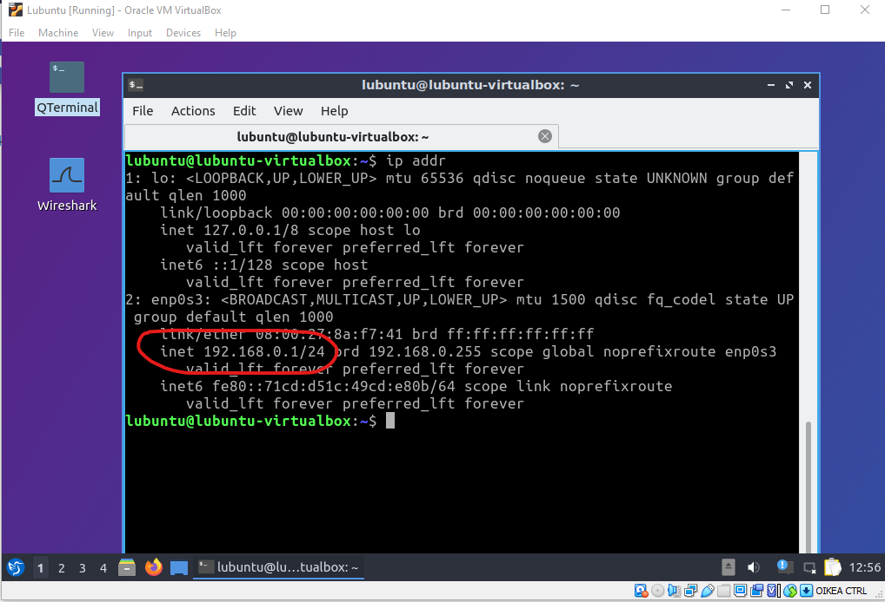

IP-osoite näyttää olevan oikea.

Suoritan saman operaation *lubuntu2*, mutta sen IP-osoite tulee olemaan `192.168.0.2`

### Yhteyden testaus
Tämän jälkeen testaan lubuntejen välisen yhteyden. Tämän voi suorittaa helposti komennolla `ping <kohde>`. Teen tämän kummallakin lubuntulla.

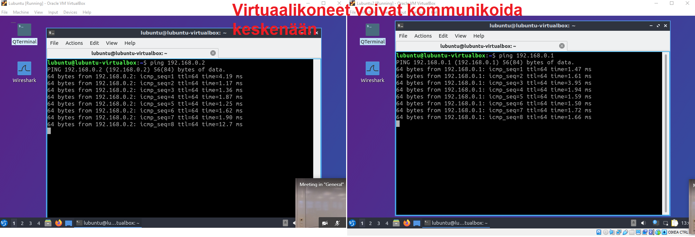

Tästä näen, että verkkoasetukset ovat konfiguroitu onnistuneesti.

### Forwarding tables
Kytkimien forwarding tablet on mahdollista tarkistaa komennolla `show fdb`:

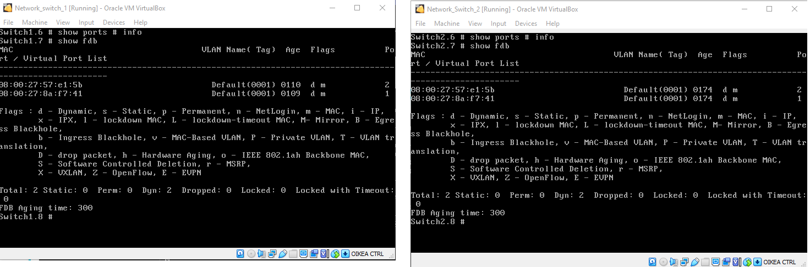

Vasemmalla näen verkkolaitteiden MAC -osoitteet. Nämä kaksi laitetta ovat minun lubuntu laitteet.

### VLAN:ien luonti
Luon VLAN:in komennolla `create vlan workstations` kytkimen komentoriviltä. VLAN tarvitsee *Ethernet 802.1Q* tagin jonka voin asettaa komennolla `configure vlan workstations tag 5`. VLAN on nyt luotu, mutta se ei ole käytössä vielä.

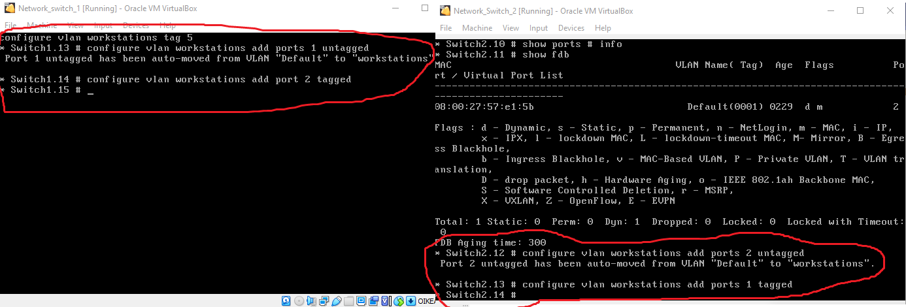

Seuraavaksi porttien väliset yhteydet pitää merkata tagged tai untagged. Palvelimien/työpisteiden ja verkkolaitteiden väliset yhteydet ovat untagged kun taas pelkkien verkkolaitteiden väliset yhteydet ovat tagged. Eli kaikki portit jotka osoittavat lubuntuja kohti ovat untagged. Tämä tehdään komennolla `configure vlan workstations add ports <portit> untagged`. Tässä tapauksessa se on portti 1. Samalla merkkaan kytkmimien väliset portin tagged komennolla `configure vlan workstations add ports 2 tagged`.

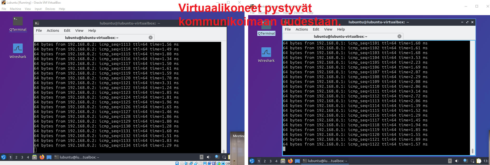

Lubuntu työpisteet pystyvät nyt kommunikoimaan toistensa kanssa uudestaan. Kaikki hyvin!

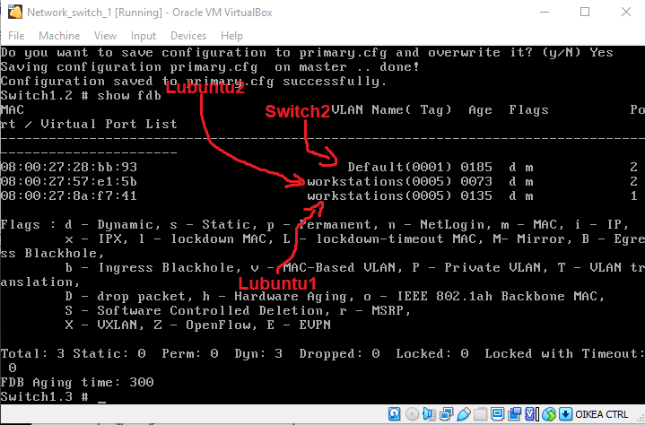

Vielä tarkistan kummankin kytkimen forwarding tablet jotta kaikki on hyvin. Laitteiden MAC osoitteen tarkistamisen jälkeen näen, että työpisteet ovat workstation VLANissa.
Tässä on hyvä tallentaa kytkimien konfigurointi vielä kun ne toimivat komennolla `save`.

### Ethernet Framen nuuskiminen wiresharkilla

Luon `Lubuntu Wireshark` virtuaalikoneen ja vaihdan se verkkoasetukset seuraavasti:

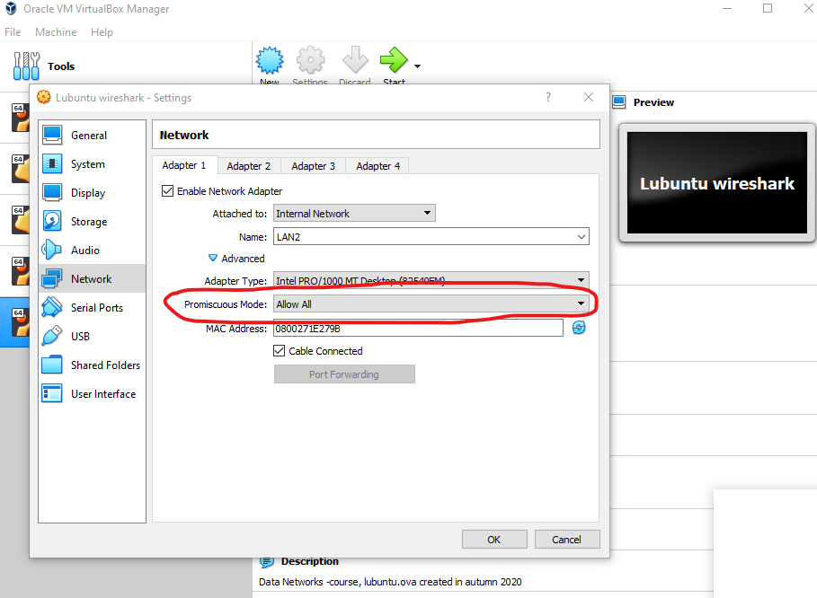

Huomaa, että tämä kone menee LAN2, eli kahden kytkimen väliin. Katsotaan, mitä saan nuuskittua.

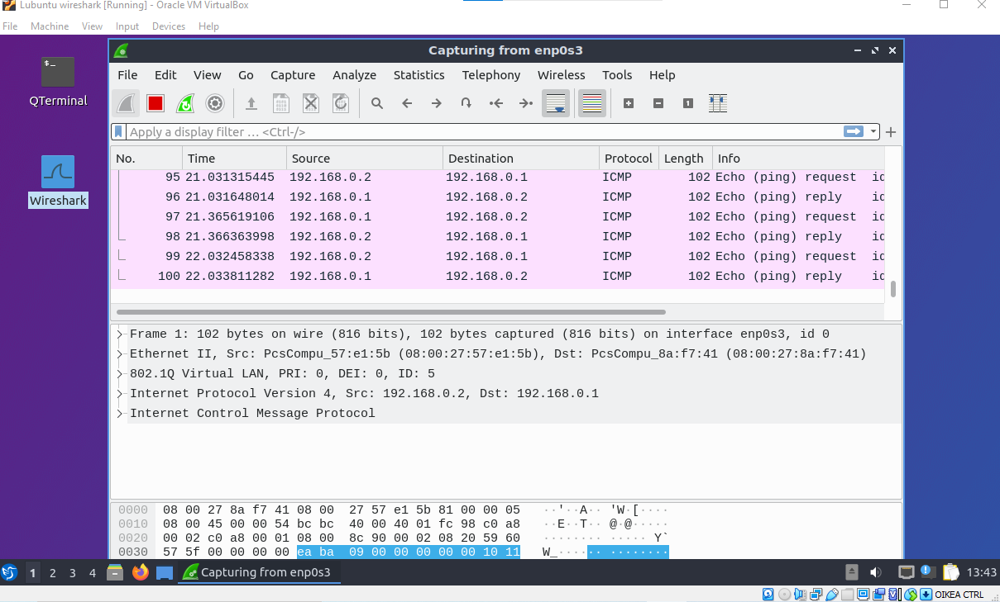

Näyttää siltä, että sain nuuskittua minun kahden lubuntun välistä kommunikaatiota. Annan wiresharkin tallentaa tämän tiedostoon jotta voin analysoida tätä dataa.

### Wireshark kysymykset

Tarkastelen tallennettua tiedostoa wiresharkilla. Otan yhden ICMP rivin ja tutkin sitä.

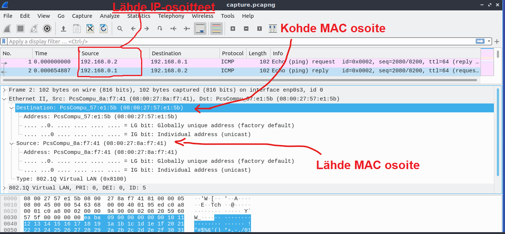

1. Find the source MAC address  
Lähde MAC osoite on 08:00:27:8a:f7:41

2. What is the Ethertype  
Ethertype on IPv4

3. Find the source IP address  
Lähde IP-osoite on 192.168.0.1

4. What is the Payload of the whole capture row?  
ICMP kohdan hex dump:  
`
0000   00 00 94 90 00 02 08 20 59 60 57 5f 00 00 00 00
0010   ea ba 09 00 00 00 00 00 10 11 12 13 14 15 16 17
0020   18 19 1a 1b 1c 1d 1e 1f 20 21 22 23 24 25 26 27
0030   28 29 2a 2b 2c 2d 2e 2f 30 31 32 33 34 35 36 37
`  
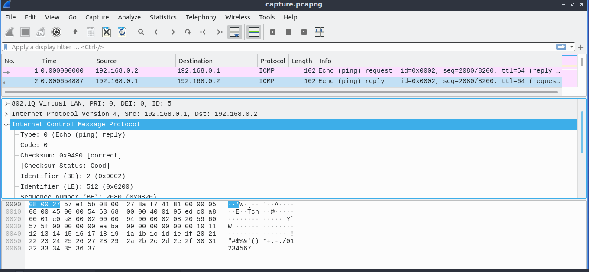


### Kytkinten konfiguroinnin tallennus

Ensin teen seuraavan kytkinten komentoriviin:  
`conf vlan workstations ipaddress 192.168.0.253/24` ja `conf vlan workstations ipaddress 192.168.0.252/24`

Tämän jälkeen otan SSH:n käyttöön kytkimissä jotta liittyä kytkimeen minun lubuntu -työpisteeltä.

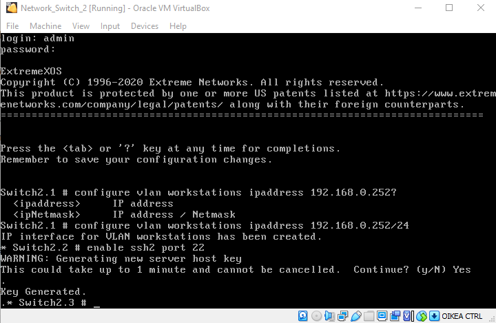

Nyt menen lubuntu koneelleni ja otan yhteyden SSH:lla minun kytkimiin:

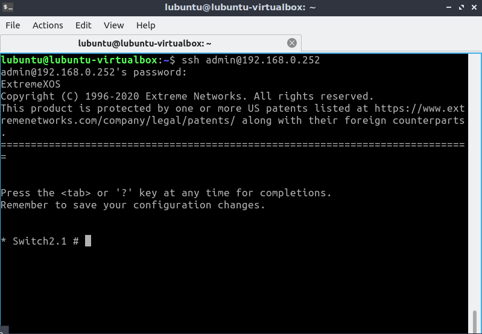

Sitten lataan etänä kummankin kytkimen konfiguraatio tiedostot komennolla `show configuration`  
```
* Switch2.1 # show configuration
#
# Module devmgr configuration.
#
configure snmp sysName "Switch2"
configure snmp sysContact "https://www.extremenetworks.com/support/"
configure sys-recovery-level switch reset

#
# Module vlan configuration.
#
configure vlan default delete ports all
configure vr VR-Default delete ports 1-2
configure vr VR-Default add ports 1-2
configure vlan default delete ports 2
create vlan "workstations"
configure vlan workstations tag 5
configure vlan Default add ports 1 untagged  
configure vlan workstations add ports 1 tagged  
configure vlan workstations add ports 2 untagged  
configure vlan workstations ipaddress 192.168.0.252 255.255.255.0

#


* Switch1.1 # show configuration 
#
# Module devmgr configuration.
#
configure snmp sysName "Switch1"
configure snmp sysContact "https://www.extremenetworks.com/support/"
configure sys-recovery-level switch reset

#
# Module vlan configuration.
#
configure vlan default delete ports all
configure vr VR-Default delete ports 1-2
configure vr VR-Default add ports 1-2
configure vlan default delete ports 1
create vlan "workstations"
configure vlan workstations tag 5
configure vlan Default add ports 2 untagged  
configure vlan workstations add ports 2 tagged  
configure vlan workstations add ports 1 untagged  
configure vlan workstations ipaddress 192.168.0.253 255.255.255.0

#
```


