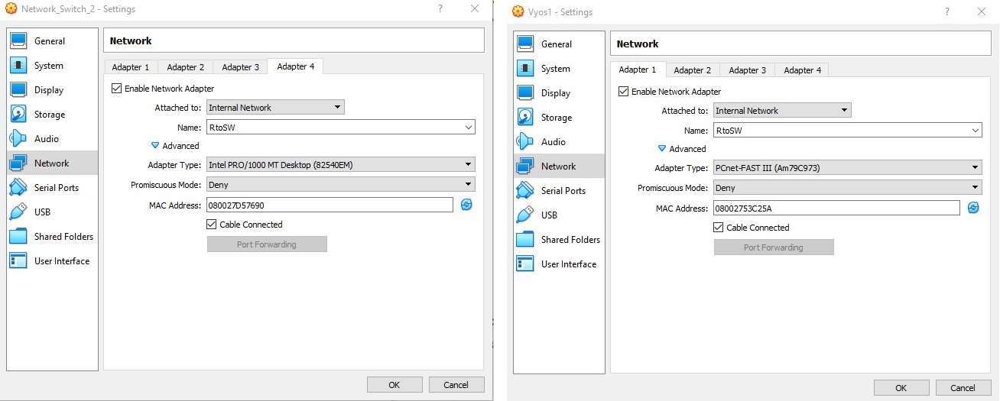
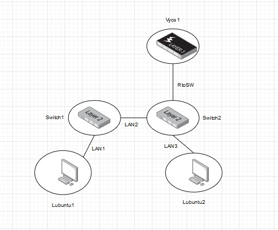
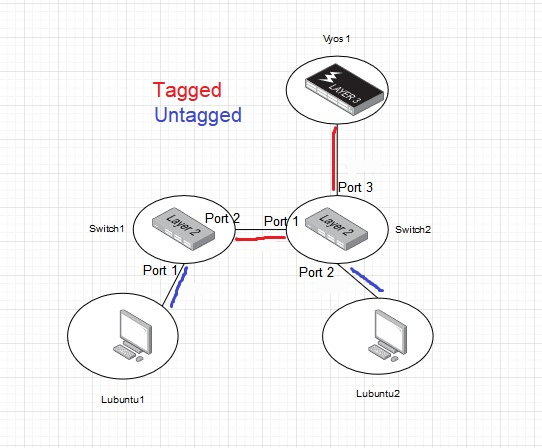
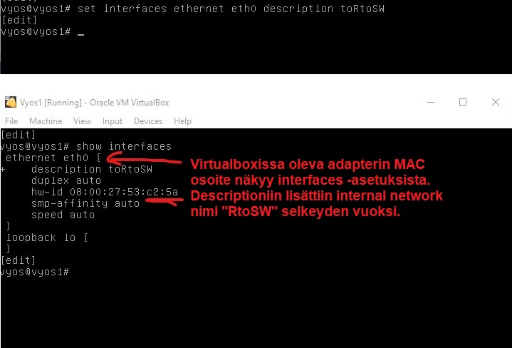
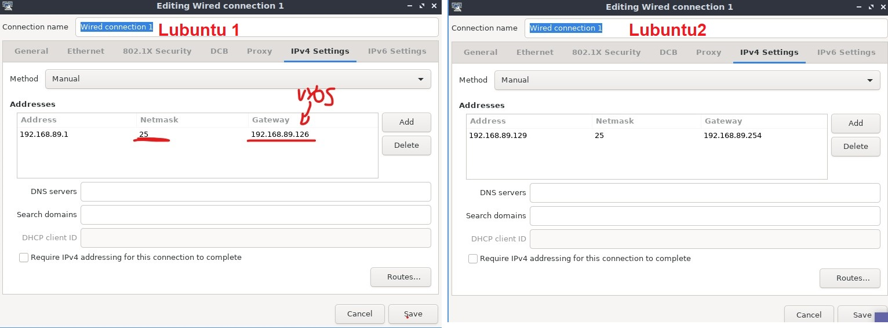
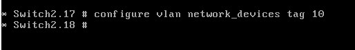
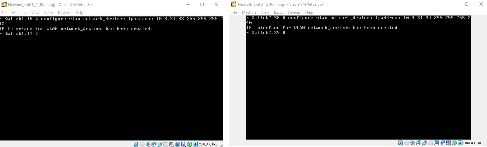
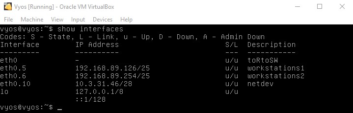
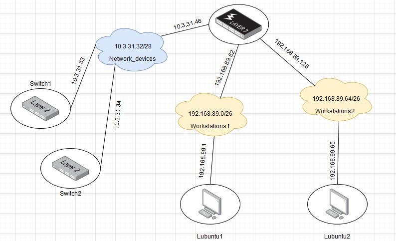

# IP-osoitteisuus

Ensin pitää lisätä vyos -reititin verkkoon. Teen tämän kytkemällä Switch2 ja vyos:in yhteen uuteen verkkoon virtuaaliboxissa. Näihin kumpaankin lisään uuden internal network adapterin ja nimeän sen RtoSW.  

  

Tämän jälkeen verkon fyysinen topologia näyttää tältä:  

  

Portit tulevat näyttämään tältä:  

  
## vyos asetukset

Haluan lisätä vyos eth0 rajapintaan descriptionin "toRtoSW" selveyden takia. Kirjaudun sisään ja menen `configure` -moodiin. Sen jälkeen  syötän komentoriville `set interfaces ethernet eth0 description toRtoSW`.  

  

Tämän jälkeen alan muuttamaan itse eth0 rajapinnan konfiguraatiota.  

Konfiguroin tehtävänannon mukaan ekat VLANit niin, että minun *Exercise 02* tekemät aliverkot olisivat näissä. Näihin VLANeihin tulee minun Lubuntut.  

  

Lajittelen vyos -gateway/router niin, että se on kaikkien aliverkkojen viimeinen käytettävä IP-osoite.  

Tämän jälkeen käytän `show interfaces` -komentoa nähdäkseni minun rajapinnat.

  

Näen, että VLANit ovat konfiguroitu. Tallennan nämä käyttämällä `commit` ja `save` -komentoa. Palaan show -moodiin tarkastamaan asetuksiani.  

  

## Lubuntujen asetukset

Lubuntu -työasemien verkkoasetukset pitää vaihtaa uuden verkkolajitelman mukaisesti.  

  

Kuvassa näkyy Lubuntujen uudet verkkoasetukset. Lubuntujen IP-osoitteet ovat heidän aliverkkojen ensimmäiset käytettävät IP-osoitteet, kun taas heidän gateway (vyos) on heidän aliverkon viimeinen käytettävä IP-osoite.  

## Kytkimien asetukset
Seuraavaksi luon uuden VLANin jonka nimeksi tulee `network_devices`. Annan niille uuden Ethernet 802.1Q tagin joka on tässä tapauksessa tag 10.  

  

Tämän jälkeen portit jotka osoittavat vyos reittimeen ja kytkimiin tägätään.  

Kun portit on tägätty, exercise 02 asennetut IP-osoitteet kytkimille pitää poistaa. Tämä tehdään komennolla `unconfigure vlan <vlan> ipaddress`. 
Tämän jälkeen lisäämme kytkimille Exercise 03 tehdyn IP-osoitteen ja maskin komennolla `configure vlan network_devices ipaddress <ip> <mask>`:  
**HUOM!!!** Kuvassa näkyvät IP osoitteet eivät ole lopullisia IP-osoitteita joita käytin. Vaikka nämä toimivat, niin vaihdoin subnettausta hieman jotta minulla riittää IP-osoitteita seuraaviin tehtäviin. Todelliset IP-osoitteet näet tämän osion lopussa.  

  

Sitten vielä syötän kytkimille gateway IP-osoitteen. Tarkoitus on, että jokaisen aliverkon viimeinen käytettävä IP-osoite on gateway:n IP, joten tässä tapauksessa se on 10.3.31.46. Tämä lisätään komennolla: `configure iproute add default <ip of router>`.  
Viimeiseksi lisätään tämä aliverkko vyos -reitittimmelle komennolla `set interfaces ethernet eth0 vif 10 address 10.3.31.46/28`.  

  

Lopulta minun *(lopullinen)* aliverkoitus näyttää tältä:  



## The moment of truth

Nyt testaan verkon toimivuutta pingaamalla ja tracerouttaamalla työasemia. Mitäköhän tapahtuu?  

  

Kaikki näyttää toimivan kuten pitää! 

## Konffaukset

network_devices konfiguroinnit ovat tässä:  
**VYOS:**  
```  
vyos@vyos:~$ show configuration 
interfaces {
interfaces {
    ethernet eth0 {
        description toRtoSW
        duplex auto
        hw-id 08:00:27:63:a0:05
        smp-affinity auto
        speed auto
        vif 5 {
            address 192.168.89.62/26
            description workstations1
        }
        vif 6 {
            address 192.168.89.126/26
            description workstations2
        }
        vif 10 {
            address 10.3.31.46/28
            description netdev
        }
    }
    loopback lo {
    }
}
protocols {
}
service {
    ssh {
        port 22
    }
}
system {
    config-management {
        commit-revisions 100
    }
    console {
        device ttyS0 {
            speed 9600
        }
    }
    host-name vyos
    login {
        user vyos {
            authentication {
                encrypted-password ****************
                plaintext-password ****************
            }
            level admin
        }
    }
    syslog {
        global {
            facility all {
                level info
            }
            facility protocols {
                level debug
            }
        }
    }
    time-zone UTC
}
```  
**Switch1:**  
```  
* Switch1.1 # show configuration 
#
# Module devmgr configuration.
#
configure snmp sysName "Switch1"
configure snmp sysContact "https://www.extremenetworks.com/support/"
configure sys-recovery-level switch reset

#
# Module vlan configuration.
#
configure vlan default delete ports all
configure vr VR-Default delete ports 1-2
configure vr VR-Default add ports 1-2
configure vlan default delete ports 1-2
create vlan "network_devices"
configure vlan network_devices tag 10
create vlan "workstations"
configure vlan workstations tag 5
create vlan "workstations2"
configure vlan workstations2 tag 6
configure vlan network_devices add ports 2 tagged  
configure vlan workstations add ports 2 tagged  
configure vlan workstations add ports 1 untagged  
configure vlan workstations2 add ports 2 tagged  
configure vlan network_devices ipaddress 10.3.31.33 255.255.255.240

#
# Module mcmgr configuration.
#

#
# Module otm configuration.
#

#
# Module fdb configuration.
#
disable iparp vr VR-Mgmt refresh
disable neighbor-discovery vr VR-Mgmt refresh

#
# Module rtmgr configuration.
#
configure iproute add default 10.3.31.46
enable icmp useredirects

#
# Module policy configuration.
#
configure policy slices tci-overwrite 0

#
# Module aaa configuration.
#
configure account admin encrypted "$5$LVUMiH$OmC73PnstIHrVfPRZiAJdGyv.u4rlpdGFNscvg5P7A5" 

#
# Module acl configuration.
#


#
# Module bfd configuration.
#

#
# Module bgp configuration.
#

#
# Module cfgmgr configuration.
#

#
# Module dnsAnalytics configuration.
#

#
# Module dosprotect configuration.
#

#
# Module dot1ag configuration.
#

#
# Module eaps configuration.
#

#
# Module edp configuration.
#

#
# Module elrp configuration.
#

#
# Module ems configuration.
#

#
# Module epm configuration.
#

#
# Module erps configuration.
#

#
# Module esrp configuration.
#

#
# Module etmon configuration.
#

#
# Module exsshd configuration.
#
enable ssh2

#
# Module hal configuration.
#
configure ports 1 debounce time 0
configure ports 2 debounce time 0

#
# Module idMgr configuration.
#

#
# Module ipSecurity configuration.
#

#
# Module isis configuration.
#

#
# Module lldp configuration.
#

#
# Module mrp configuration.
#

#
# Module msdp configuration.
#

#
# Module netLogin configuration.
#

#
# Module netTools configuration.
#

#
# Module nodealias configuration.
#

#
# Module ntp configuration.
#

#
# Module ospf configuration.
#

#
# Module ospfv3 configuration.
#

#
# Module pim configuration.
#

#
# Module poe configuration.
#

#
# Module rip configuration.
#

#
# Module ripng configuration.
#

#
# Module snmpMaster configuration.
#
configure snmpv3 engine-id 03:08:00:27:87:1f:97

#
# Module stp configuration.
#
configure mstp region 080027871f97
disable stpd s0

#
# Module techSupport configuration.
#

#
# Module telnetd configuration.
#
disable telnet

#
# Module tftpd configuration.
#

#
# Module thttpd configuration.
#

#
# Module twamp configuration.
#

#
# Module vmt configuration.
#

#
# Module vrrp configuration.
#

#
# Module vsm configuration.
#

#
# Module vpex configuration.
#

```  
**Switch2:**  
```  
* EXOS-VM.1 # show configuration 
#
# Module devmgr configuration.
#
configure snmp sysContact "https://www.extremenetworks.com/support/"
configure sys-recovery-level switch reset

#
# Module vlan configuration.
#
configure vlan default delete ports all
configure vr VR-Default delete ports 1-3
configure vr VR-Default add ports 1-2
configure vlan default delete ports 1-3
create vlan "network_devices"
configure vlan network_devices tag 10
create vlan "workstations1"
configure vlan workstations1 tag 5
create vlan "workstations2"
configure vlan workstations2 tag 6
configure vlan network_devices add ports 1,3 tagged  
configure vlan workstations1 add ports 1,3 tagged  
configure vlan workstations2 add ports 1,3 tagged  
configure vlan workstations2 add ports 2 untagged  
configure vlan network_devices ipaddress 10.3.31.34 255.255.255.240

#
# Module mcmgr configuration.
#

#
# Module otm configuration.
#
configure virtual-network add network ports 1-2 

#
# Module fdb configuration.
#
disable iparp vr VR-Mgmt refresh
disable neighbor-discovery vr VR-Mgmt refresh

#
# Module rtmgr configuration.
#
configure iproute add default 10.3.31.46
enable icmp useredirects

#
# Module policy configuration.
#
configure policy slices tci-overwrite 0

#
# Module aaa configuration.
#
configure account admin encrypted "$5$LVUMiH$OmC73PnstIHrVfPRZiAJdGyv.u4rlpdGFNscvg5P7A5" 

#
# Module acl configuration.
#


#
# Module bfd configuration.
#

#
# Module bgp configuration.
#

#
# Module cfgmgr configuration.
#

#
# Module dnsAnalytics configuration.
#

#
# Module dosprotect configuration.
#

#
# Module dot1ag configuration.
#

#
# Module eaps configuration.
#

#
# Module edp configuration.
#

#
# Module elrp configuration.
#

#
# Module ems configuration.
#

#
# Module epm configuration.
#

#
# Module erps configuration.
#

#
# Module esrp configuration.
#

#
# Module etmon configuration.
#

#
# Module exsshd configuration.
#
enable ssh2

#
# Module hal configuration.
#
configure ports 1 debounce time 0
configure ports 2 debounce time 0
configure ports 3 debounce time 0

#
# Module idMgr configuration.
#

#
# Module ipSecurity configuration.
#

#
# Module isis configuration.
#

#
# Module lldp configuration.
#
disable lldp ports 3

#
# Module mrp configuration.
#

#
# Module msdp configuration.
#

#
# Module netLogin configuration.
#

#
# Module netTools configuration.
#

#
# Module nodealias configuration.
#
configure nodealias ports 1 maxentries 4096
configure nodealias ports 2 maxentries 4096

#
# Module ntp configuration.
#

#
# Module ospf configuration.
#

#
# Module ospfv3 configuration.
#

#
# Module pim configuration.
#

#
# Module poe configuration.
#

#
# Module rip configuration.
#

#
# Module ripng configuration.
#

#
# Module snmpMaster configuration.
#
configure snmpv3 engine-id 03:08:00:27:87:1f:97

#
# Module stp configuration.
#
configure mstp region 080027871f97
disable stpd s0

#
# Module techSupport configuration.
#

#
# Module telnetd configuration.
#
disable telnet

#
# Module tftpd configuration.
#

#
# Module thttpd configuration.
#

#
# Module twamp configuration.
#

#
# Module vmt configuration.
#

#
# Module vrrp configuration.
#

#
# Module vsm configuration.
#

#
# Module vpex configuration.
#
```  


 


  


 


  
