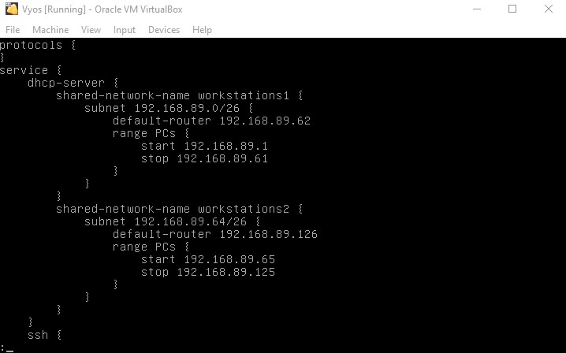
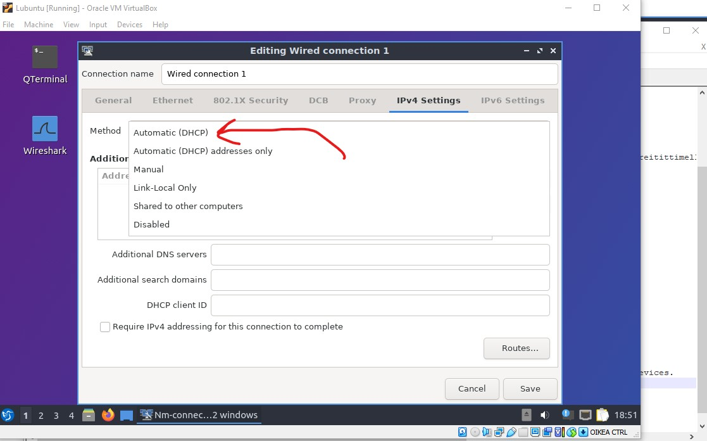
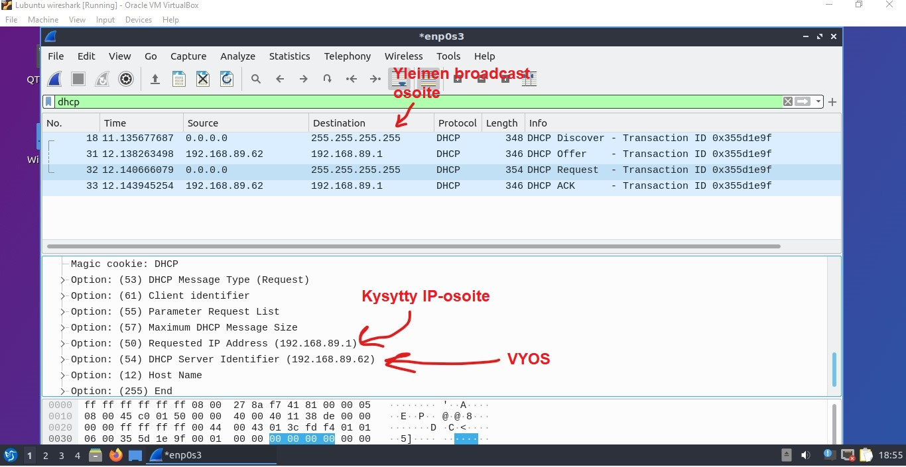
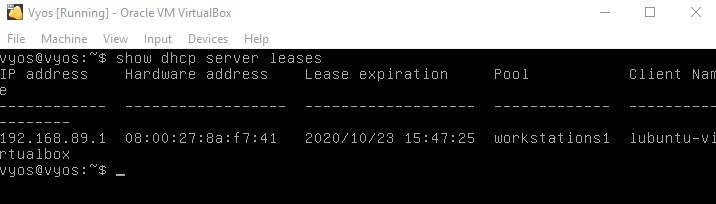

# DHCP ja staattinen reititys

Ensin kloonaan ja kytken uudet laitteet vyos2 ja Lubuntu3 tehtävää varten. Kaapelointi tulee tapahtumaan kartan mukaan: 

  

Aloitan kytkemällä Lubuntu3 ja vyos2 yhteen LAN4 kautta. Tämän jälkeen annan uuden aliverkon vyos2:selle käyttämällä komentoa `set interface ethernet eth0 address 192.168.89.190/26`  
Tämän jälkeen annan Lubuntu3 IP osoitteen ja gatewayn. Lopulta asetukset näyttävät tältä:  

  

Tämän jälkeen testaan toimivuutta pingillä:  

  

Toimivuus on testattu! Jatkan kytkemällä Vyos2 ja Vyos1 yhteen RtoR internal network kautta. Asetan kummallekkin reitittimelle IP-osoitteen heidän uuteen rajapintaan:  

 

Testaan vielä, että kaikki toimivat pingillä...  

  
 
Kaikki toimivat kuten pitää. Nykyinen verkkotopologia näyttää tältä:  

 

## DHCP asentaminen

Aloitan DHCP asentaminen vyos:seille. Vyosiin voi lisätä DHCP palvelimen `configure` -moodissa. 
Tämä tehdään komennoilla:  
`set service dhcp-server shared-network-name workstations1 subnet 192.168.89.0/26 default-router 192.168.89.62`  
`set service dhcp-server shared-network-name workstations1 subnet 192.168.89.0/26 range PCs start 192.168.89.1`  
`set service dhcp-server shared-network-name workstations1 subnet 192.168.89.0/26 range PCs stop 192.168.89.61`  

Teen tämän jokaiselle aliverkolle jotka tarvitsevat DHCP:ta. Tässä tapauksessa ne ovat kaikki, paitsi network_devices.  

 
 
Tämän jälkeen vaihdan Lubuntujen manuaaliset verkkoasetukset automaattiseen ja katsotaan miten käy...  

 

Vielä lisäksi mielenkiinnon perustein katson DHCP palvelimen ja Lubuntu1 välistä keskustelua wiresharkilla:  

 

Kuten wiresharkin tuloksista näkee, työasema ensin huhuilee yleiseen broadcast osoitteeseen **DHCPdiscover**, että onko verkossa DHCP palvelinta.  
Tämän jälkeen DHCP palvelin *(vyos)* vastaa **DHCPoffer** paketilla ja antaa työasemalle konfiguraatio parametrit.  
Sitten työasema vastaa tähän **DHCPrequest** paketilla joka pyytää `dhcp binding` näillä parametreilla.  
Viimeiseksi DHCP palvelin vastaa tähän **DHCPack** paketilla, joka vahvistaa dhcp bindauksen ja parametrit kummallekkin osapuolelle.  

 

Kuvasta näkee, että lubuntu1 on saanut IP-osoitteen onnistuneesti.  
On mahdollista tarkistaa dhcp leases menemällä vyosin komentoriville ja käyttää komentoa `show dhcp server leases`:  

  

Teen tämän saman toimenpiteen kaikille aliverkoille paitsi network_devices, kuten sanoin aiemmin.  

## Staattinen reititys

Seuraavaksi minä säädän staattisen reitityksen vyos1 ja vyos2 välille.  

Saan luotua staattisen reitityksen käyttämällä komentoa `set protocols static route <subnet> next-hop <address>`.  
Tässä tapauksessa vyos1 syötän komennon: `set protocols static route 192.168.89.128/26 next-hop 10.3.31.130`  
vyos2 syötän komennot: `set protocols static route 192.168.89.0/26 next-hop 10.3.31.129` ja  `set protocols static route 192.168.89.64/26 next-hop 10.3.31.129`  

Tämän jälkeen testaan staattisen reitityksen toimivuutta `ping` -ja `traceroute` komennoilla:  

  

Pingit rullaa hienosti!

### Konffaukset

Koko verkon topologia näkyy tässä:  

  

**VYOS1:**  
```  
vyos@vyos:~$ show configuration 
interfaces {
    ethernet eth0 {
        description toRtoSW
        duplex auto
        hw-id 08:00:27:63:a0:05
        smp-affinity auto
        speed auto
        vif 5 {
            address 192.168.89.62/26
            description workstations1
        }
        vif 6 {
            address 192.168.89.126/26
            description workstations2
        }
        vif 10 {
            address 10.3.31.30/27
            description netdev
        }
    }
    ethernet eth2 {
        address 10.3.31.129/30
        description toRtoR
        hw-id 08:00:27:e6:db:28
    }
    loopback lo {
    }
}
protocols {
    static {
        route 192.168.89.128/26 {
            next-hop 10.3.31.130 {
            }
        }
    }
}
service {
    dhcp-server {
        shared-network-name workstations1 {
            subnet 192.168.89.0/26 {
                default-router 192.168.89.62
                range PCs {
                    start 192.168.89.1
                    stop 192.168.89.61
                }
            }
        }
        shared-network-name workstations2 {
            subnet 192.168.89.64/26 {
                default-router 192.168.89.126
                range PCs {
                    start 192.168.89.65
                    stop 192.168.89.125
                }
            }
        }
    }
    ssh {
        port 22
    }
}
system {
    config-management {
        commit-revisions 100
    }
    console {
        device ttyS0 {
            speed 9600
        }
    }
    host-name vyos
    login {
        user vyos {
            authentication {
                encrypted-password ****************
                plaintext-password ****************
            }
            level admin
        }
    }
    syslog {
        global {
            facility all {
                level info
            }
            facility protocols {
                level debug
            }
        }
    }
    time-zone UTC
}
```   
**VYOS2:**  
```  
vyos@vyos:~$ show configuration 
interfaces {
    ethernet eth0 {
        address 192.168.89.190/26
        description toLAN4
        duplex auto
        hw-id 08:00:27:89:98:4c
        smp-affinity auto
        speed auto
    }
    ethernet eth1 {
        address 10.3.31.130/30
        description toRtoR
        hw-id 08:00:27:c1:29:c9
    }
    loopback lo {
    }
}
protocols {
    static {
        route 192.168.89.0/26 {
            next-hop 10.3.31.129 {
            }
        }
        route 192.168.89.64/26 {
            next-hop 10.3.31.129 {
            }
        }
    }
}
service {
    dhcp-server {
        shared-network-name workstations3 {
            subnet 192.168.89.128/26 {
                default-router 192.168.89.190
                range PCs {
                    start 192.168.89.129
                    stop 192.168.89.189
                }
            }
        }
    }
    ssh {
        port 22
    }
}
system {
    config-management {
        commit-revisions 100
    }
    console {
        device ttyS0 {
            speed 9600
        }
    }
    host-name vyos
    login {
        user vyos {
            authentication {
                encrypted-password ****************
                plaintext-password ****************
            }
            level admin
        }
    }
    syslog {
        global {
            facility all {
                level info
            }
            facility protocols {
                level debug
            }
        }
    }
    time-zone UTC
}
```  


 


