# STP

Aloitan piirtämällä fyysisen topograafisen kartan tulevasta verkosta. Muunnin joidenkin LAN:ien numeroita, jotta selkeys pysyisi.  

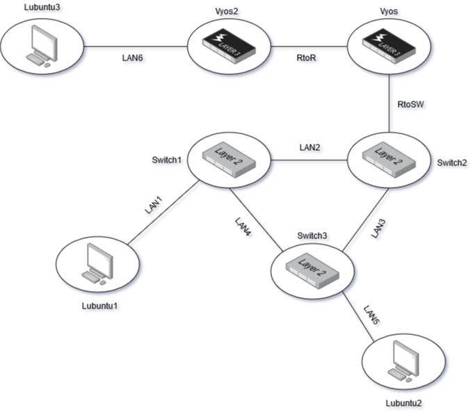  

Kloonaan kolmannen kytkimen ja alan asettamaan virtuaalikoneiden verkkoasetuksia kuvan mukaan.  
Tämän jälkeen aloitan kytkinten konfiguroinnin. Asetan uudet portit ja tagit kytkimille. Varmistan, että ainakin yksi kytkin on pois päältä kun teen näitä asetuksia. VLAN tagit menevät kuvan mukaisesti:  

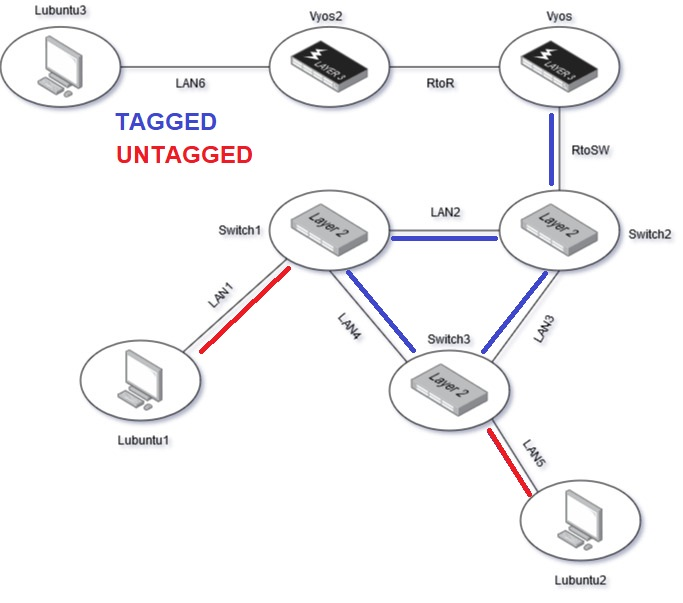  

Tämän jälkeen testaan verkon toimivuutta työasemilta:  

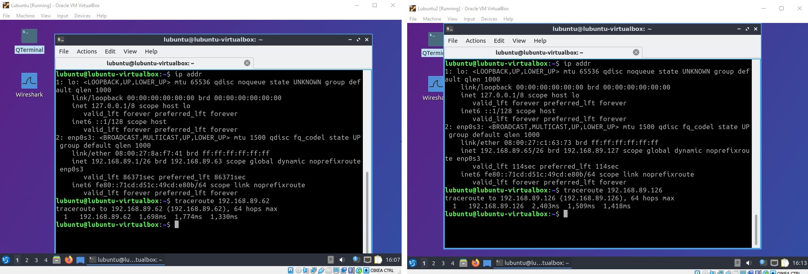  

Työasemat näkevät Vyosin. Erinomaista!  

## Nuking this network with no survivors

Aika tehdä looppi. Dokumentoin läppärini tilaa ennen kun pistän kytkimet päälle:  

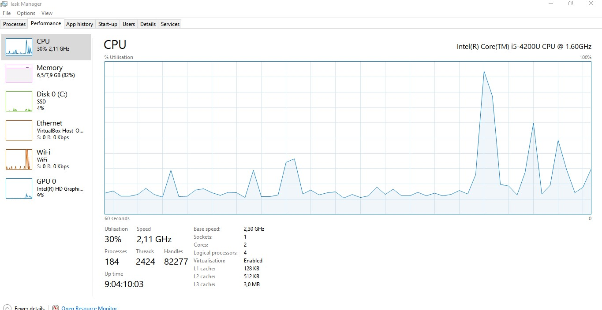  

CPU käyttö leijuu noin 10-20% paikkeella. Aika pistää kytkimet päälle...  

Laitoin Lubuntut pingittämään toisiaan kun pistin kytkimet päälle. Mitään ei tapahtunut joten käynnistin Lubuntut uudelleen ja vaihdoin niiden MAC osoitteet. Samantien kun Lubuntut käynnistyivät, niin CPU usage hyppäsi 100% ja läppäri melkein leipo kiinni. Oletan, että onnistuin packet stormin luomisessa. Tallensin muutaman screenshotin:  

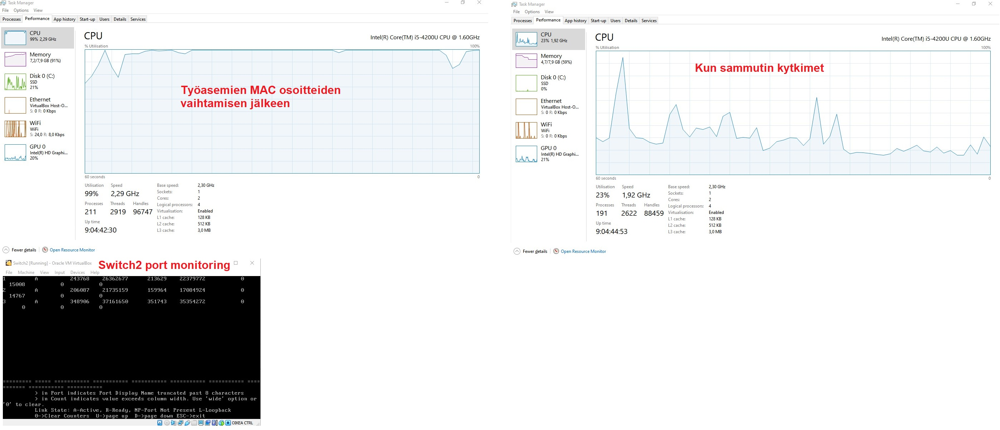  

## STP aktivointi

Aloitan STP konfiguroinnin, jotta minun läppärin ei tarvitse kärsiä moisesta enää. STP lisätään VLAN:eihin komennolla `configure stpd s0 add vlan <name> ports all`. Lisään STP:n kaikkille kytkimille ja kaikille VLAN:eille. Tämän jälkeen komento `enable stpd s0` kytkee STP:n päälle.  Tarkastellaan CPU:n kuormaa kun aloitan työasemien välisen kommunikoinnin:  

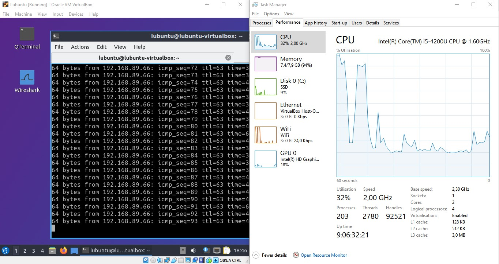  

Läppäri nyt tykkää. Kaikki näyttää toimivan ongelmitta.  

## STP konfigurointi

Aloitan kytkinten porttien tarkastelun. Komennolla `show stpd s0` ja `show stpd s0 ports` näen kytkinten STP konfiguraatiot ja porttien tilat.  

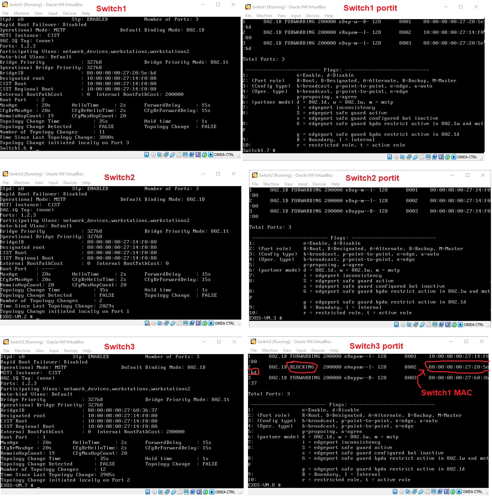  

Tästä voin piirtää nykyisen STP topologian:  

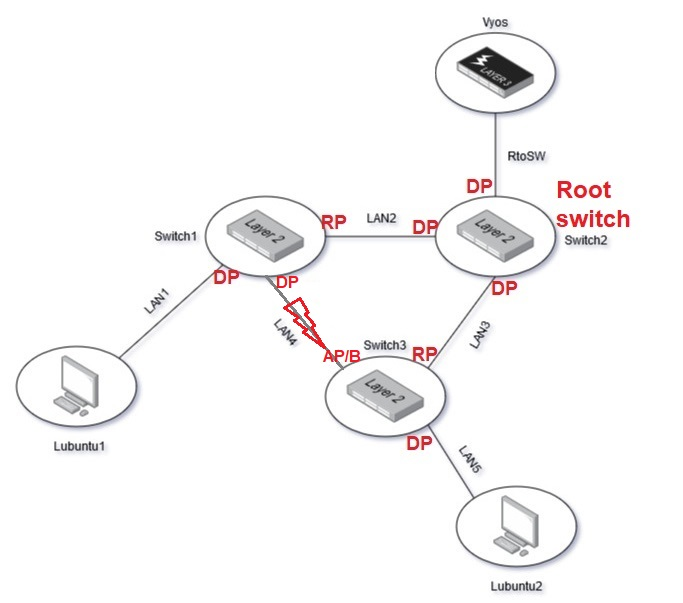  

Kuten tästä näkee, Switch2 on sattumoisin root switch. Tämä on hyvä, sillä Switch2 on lähin kytkin vyos reitittimeen. Porttien tilat ovat myös hyvät, joten näitä ei tarvitse muuttaa. 

Vaikka Switch2 on valittu root bridgeksi, aion silti vaihtaa sen prioriteetin pienimmäksi sen oletusarvosta. Teen tämän komennolla `configure stpd s0 priority 4096`.  

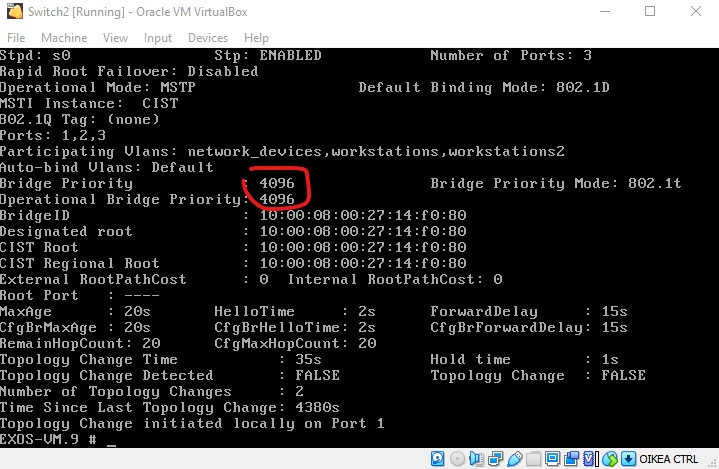  

## STP testausta

Aloitan testauksen menemällä työasemille ja pingittämällä toisiaan. Kaiken teorian mukaan jos katkaisen yhteyden Switch1 ja Switch2 väliltä, niin reitti Switch1 ja Switch3 välillä alkaisi rullaamaan. Voin testata tätä menemällä Switch2:Selle ja käyttämällä komentoa `disable ports 1`. Katsotaan, mitä tapahtuu.  

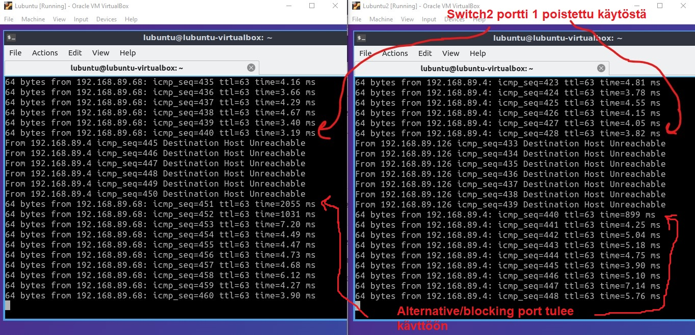  

Näen, että ICMP paketit 441-450 Lubuntu1 puolelta katosivat portin sulkemisen jälkeen. Samanlainen tilanne Lubuntu2 puolella. Pingit lopulta alkoivat rullaamaan portin disabloimisen jälkeen. Erinomaista! Topologia näyttää tältä portin sulkemisen jälkeen:  

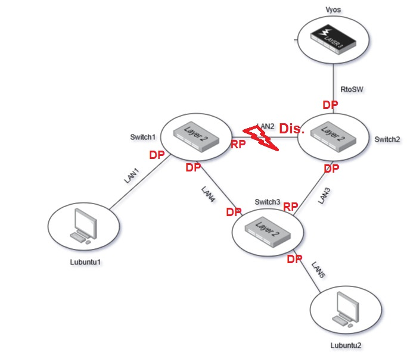  

