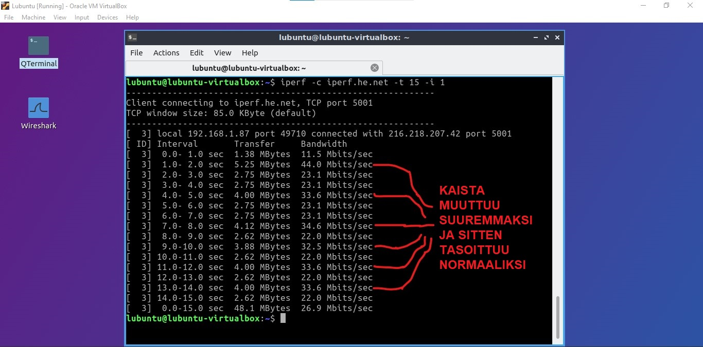
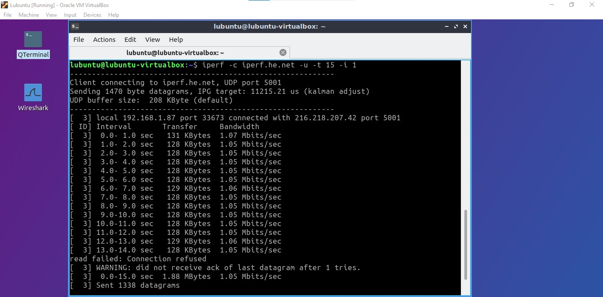
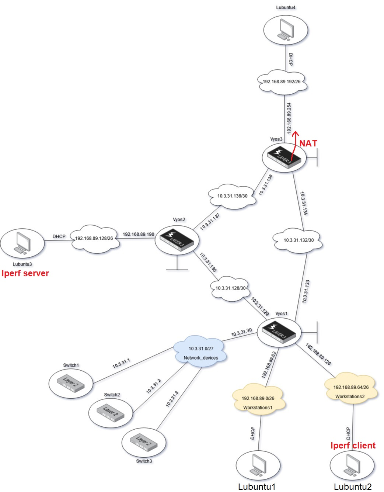
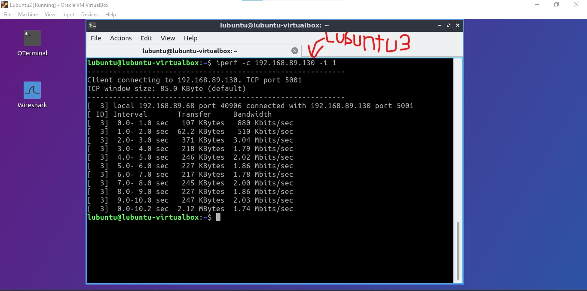
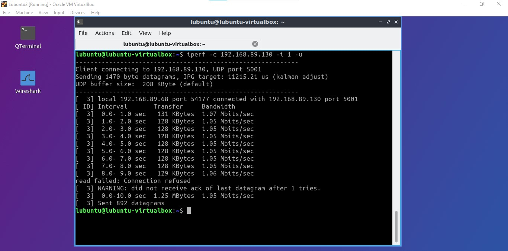
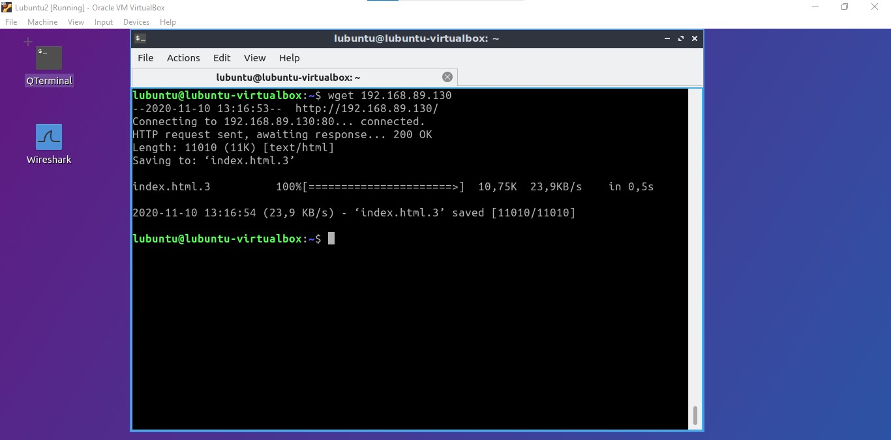
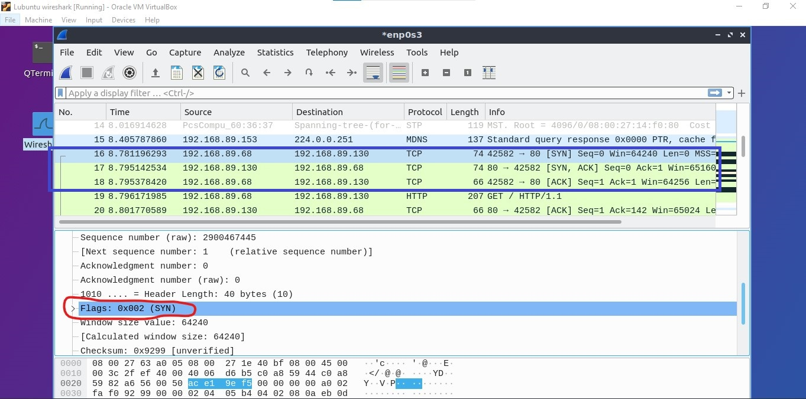
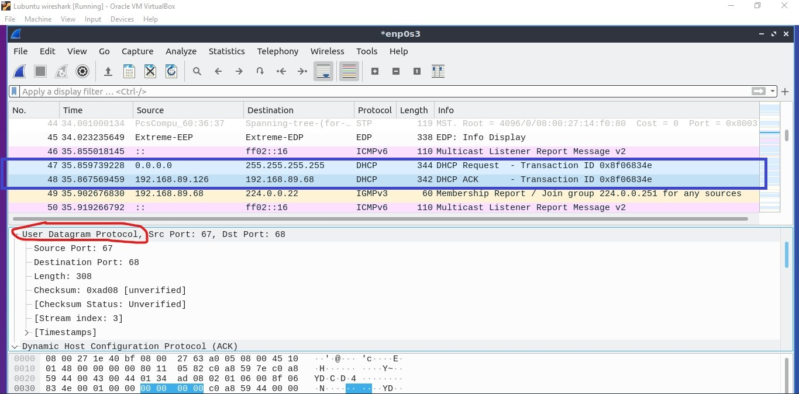

# TCP ja UDP

Aloitan muuttamalla Lubuntu1 verkkoadapterin asetuksia vaihtamalla se `bridged network` -tilaan.  

Boottaan Lubuntu1 ja aloitan testin syöttämällä komennon `iperf -c iperf.he.net`  

  

Kuvasta näkee, että komennolla luodaan `TCP` yhteys palvelimeen käyttäen porttia `5001`. Huomioitavaa on, että minä käytän tässä tapauksessa porttia `49700`. `TCP window size` kertoo kuinka suurta ikkunaa käytetään. Tässä tapauksessa 85 kilotavun ikkunoita. Näen myös kuvasta kuinka paljon dataa on siirretty yhteensä ja kaistanleveyden. Tämä voi olla tärkeää tietoa tietoverkkojen testauksessa.  

On mahdollista käyttää `-t` -parametria jolla voidaan muuttaa testauksen aikaa. `-i` parametrilla voidaan raportoida tuloksia eri välein. Kokeilen lähettää dataa 15 sekunnin ajaksi ja mittaan tuloksia joka sekuntti komennolla `iperf -c iperf.he.net -t 15 -i 1`.  

   

Kuvasta näen, että kaista muuttuu kokoajan. Tämä johtuu siitä, että kulkevassa yhteydessä ikkunoiden koko muuttuu kokoajan. TCP käyttää mahdollisimman paljon kaistanleveyttä ja osapuolet neuvottelevat kokoajan ikkunan koosta. Tämä aiheuttaa kuvassa näkyvän vaihtelun.  

Nyt testaan samaa komentoa, mutta lisään parametrin `-u` joka vaihtaa protokollan UDP:ksi. UDP ei käytä niin paljon kaistaa kuten TCP joten katsotaan mikä on tulos...  

  

Kaistanleveys pysyy lähes samana kokoajan. UDP:ssä ei suoriteta alkukättelyä, pakettien kuittausta eikä yhteyden lopettamista. Kuten tästä näkee, se ei silti ole nopeampi kuin TCP, koska TCP:n liukuva ikkuna kompensoi tehokkaasti kuittausten viemää aikaa.  

## Verkon sisäinen testaus

Boottaan tietoverkkoni ja päätän, että Lubuntu3 on Iperf palvelin. Teen tämän syöttämällä sille komennon `iperf -s`. Käytän Lubuntu2 clienttina jolla testaan tietoliikennettä. Kuvasta näkee tarkemmin, mitkä laitteet ovat mitäkin. **HUOM** Kuva on Layer 3 näkökulmasta.  

  

Aloitan testauksen syöttämällä komennon `iperf -c 192.168.89.130 -i 1` jotta näen tulokset joka sekuntti. Katsotaan mikä on tulos...  

  

Kuvasta näen, että verkkoni kaistanleveys leijuu noin 1,8 Mbit/s alueella. TCP ikkunan neuvottelu isontaa kaistaa välillä jopa 3Mbit/s hetkeksi. Huomattavaa on myös, että client käyttää porttia 40906 kommunikoidakseen.  

Nyt testaan samaa komentoa, mutta käytän UDP protokollaa. Katsotaan miten käy...  

  

Näen, että kaistanleveys on aika tasaisesti 1Mbit/s alueella. UDP:ssä ei ole liukuvaa ikkunaa joten kaistanleveyden vaihtelevuutta ei normaalistä nähdä toisin kuin TCP:ssä.  

## TCP Wiresharkkailu

Boottaan kolmannen Lubuntun joka toimii wiresharkkina. Kytken sen Lubuntu2 verkkoon odottamaan tulevia yhteyksiä.  

Lataan iperf -palvelimen koneelta index.html tiedoston komennolla `wget 192.168.89.130`:  

  

Tämä toimii TCP (ja HTTP) protokollalla, joten minun wiresharkin pitäisi pystyä näkemään TCP:n kolmisuuntaisen kättelyn. Katsotaan mitä löydän...  

  

Wiresharkista näen, että TCP kättely on tapahtunut. Ensiksi client (*192.168.89.68*) lähettää palvelimelle (*192.168.89.130*) paketin *SYN* lipulla.  

  

Tässä palvelin vastaa clientille TCP kättelyn toisessa vaiheessa *SYN ACK* lipulla. Tämä tarkoittaa, että palvelin haluaa jatkaa TCP yhteyden luomista.

  

TCP kättelyn viimeisessä osassa client lähettää paketin *ACK* lipulla palvelimelle. Tällä varmistetaan, että client on saanut vastauksen palvelimelta ja nyt osapuolet ovat valmiita tiedonsiirtoon.  

## UDP Wiresharkkailu

Boottaan Lubuntu2 uudestaan ja kuuntelen wiresharkilla DHCP kommunikointia. Katsotaan, jos löydän sen...  

  
  

Kuvasta näen, että DHCP käyttää UDP protokollaa ja palvelin käyttää porttia 67 joka on DHCP:n standardi portti. Huomattavaa on se, että tässä ei tapahtunut minkäänlaista kättelyä tai verifikaatiota siitä, että toinen osapuoli sai paketin perille. Client huhuili, että onko täällä DHCP palvelinta jonka jälkeen palvelin vastasi takaisin antamalla IP-osoitteen. Tällaista protokollaa kutsutaan *"yhteydettömäksi protokollaksi"*.

