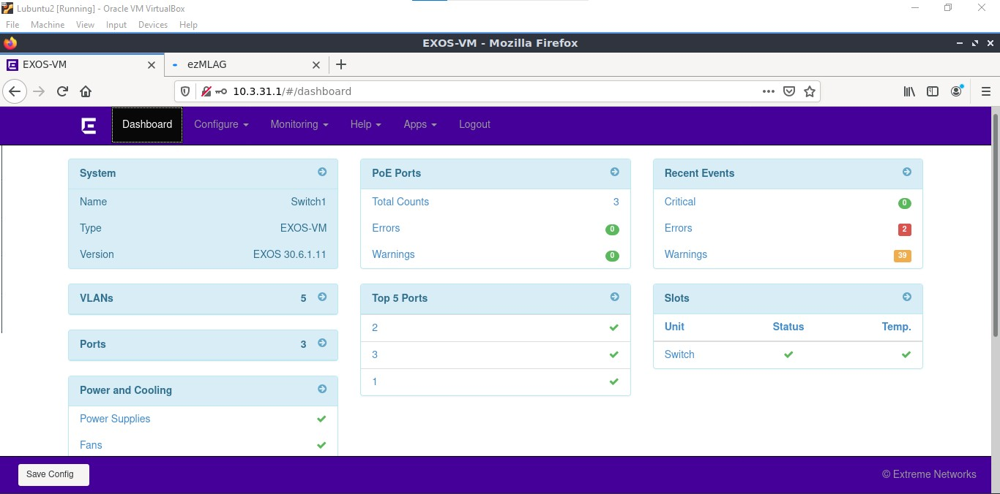
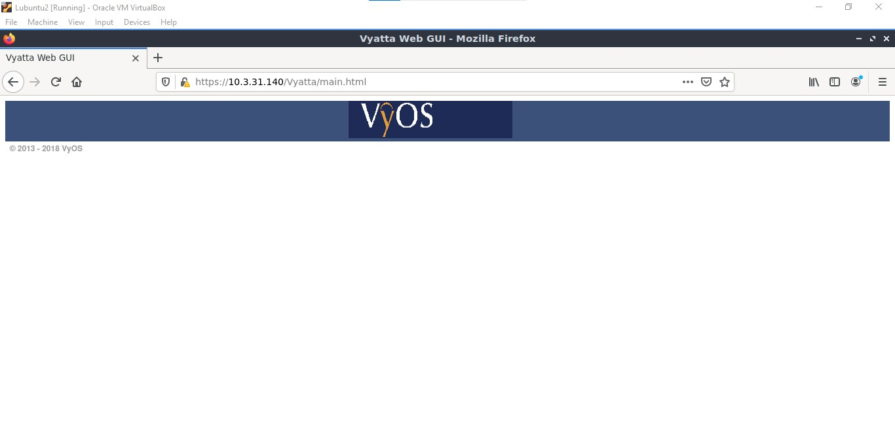
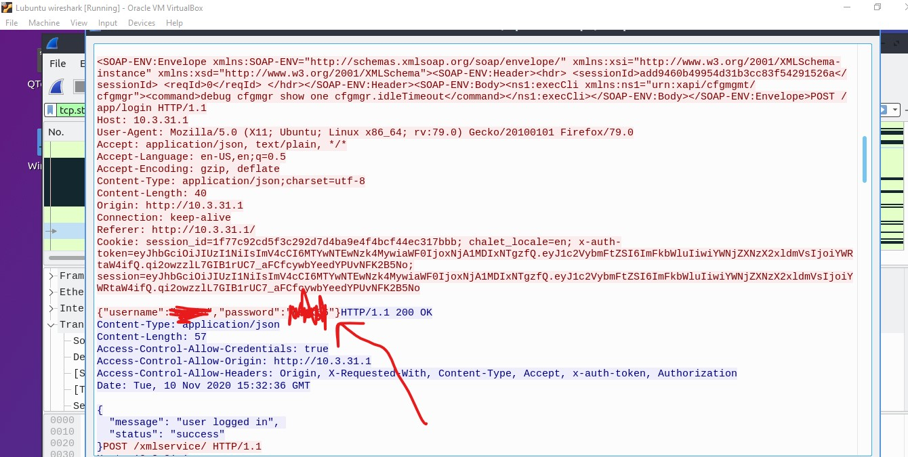

# Verkon hallinta

Aloitan kytkemällä SSH:n päälle jokaiseen verkkolaitteeseen. Tällä voin helposti tehdä yhteyden Lubuntulta mille verkkolaitteelle vain.  

SSH:n lisääminen kytkimille onnistuu komennolla `enable ssh2 port 22` ja reitittimille komennolla `set service ssh port 22`.  

Tästä syntyy pöytä jossa on linkki kaikkien verkkolaitteiden konfiguraatiotiedostoon:   

| Laite   	| .cfg tiedosto                         	|
|---------	|---------------------------------------	|
| Switch1 	| [Switch1 linkki](E12/E12-Switch1.cfg) 	|
| Switch2 	| [Switch2 linkki](E12/E12-Switch2.cfg) 	|
| Switch3 	| [Switch3 linkki](E12/E12-Switch3.cfg) 	|
| Vyos1   	| [Vyos1 linkki](E12/E12-vyos1.cfg)     	|
| Vyos2   	| [Vyos2 linkki](E12/E12-vyos2.cfg)     	|
| Vyos3   	| [Vyos3 linkki](E12/E12-vyos3.cfg)     	|  

 
## Verkkolaitteiden web interface

Otan web interfacen käyttöön Switch1 ja Vyos1:seen. Kytkimiin saan web interfacen käyttöön komennolla `enable web http` ja reitittimille komennolla `set service https listen-address [IPv4 address on the Router - e.g. loopback]`.  

Tämän jälkeen otan näihin palvelimiin yhteyden Lubuntu2:sesta, kirjaudun sisään ja katson mitä löydän.  

  

Tässä näyttää olevan kaikki mitä olen itse käyttänyt harkoissa ennen, mutta tämä web interface on hieman hidas joten en tulisi käyttämään tulevaisuudessa. Poikkeuksena on `Recent events` ja `Errors` -osio, joka näyttää hyvin oleelliselta tietoverkkojen hallinnassa. En tiedä näille vastaavaa CLI komentoa mutta olen varma että sellainen on olemassa.  

  

Toisaalta reitittimien web interface on hieman.... Puutteellinen. Pitäiskö tässä tehdä oma web interface...  

## Salasanan nuuskiminen

Huomasin, että minun wireshark lubuntu oli päällä edellisestä harjoituksesta. Päätin tarkistaa mitä löysin sieltä ja huomasin, että minun kytkimen admin tunnus ja salasana oli nuuskittu :fearful:  

  

Ehkä maailman helpoin tietoverkon pwnaus. Tarvitsee jonkinlaisen salauksen :D

