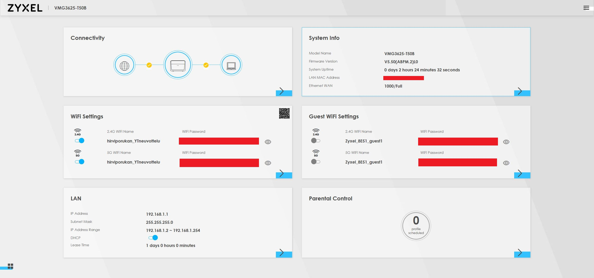
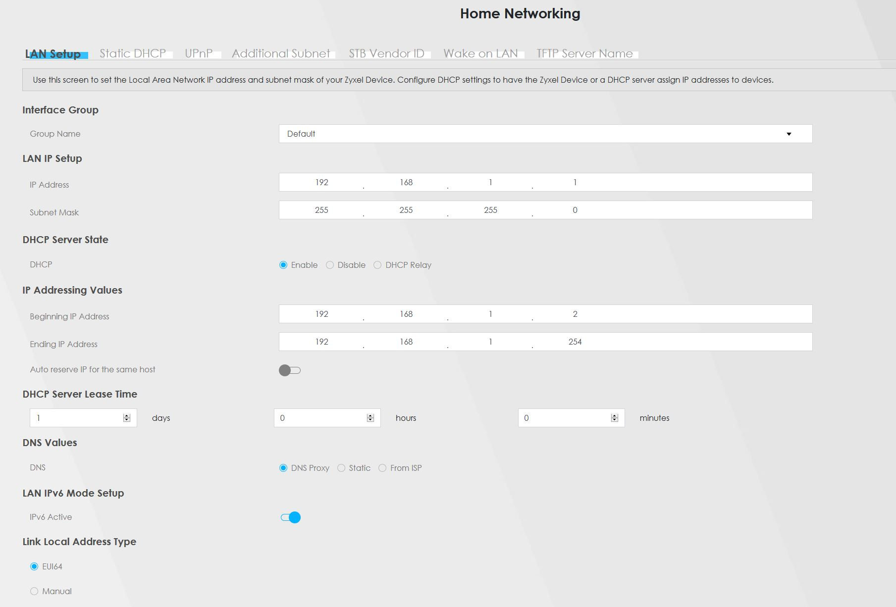
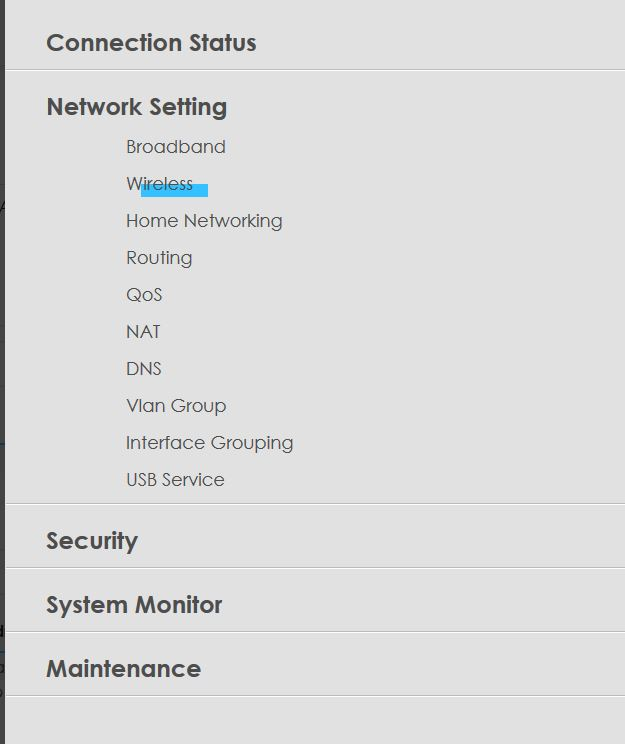
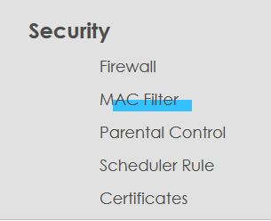
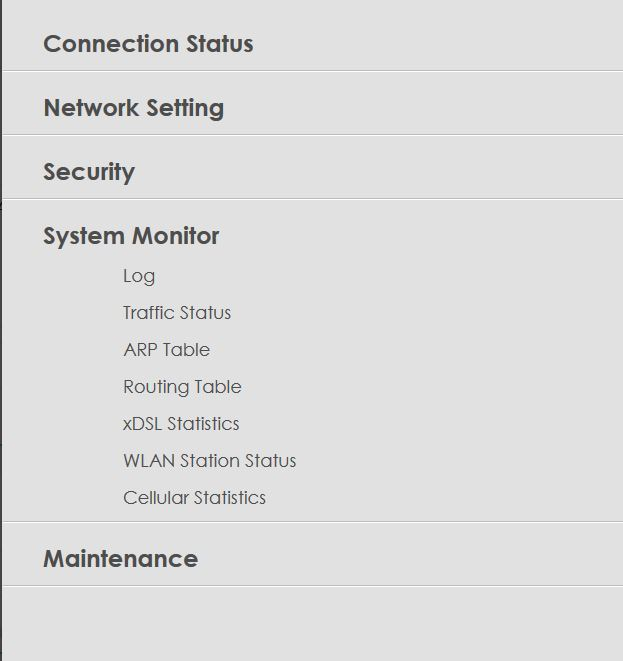

# WLAN

Tarkastan 'Wifi Analyzer' -ohjelmalla, miten lähialueen wifi kanavataajuuksia käytetään:  

  

Näen, että alueella ei ole täysin vapaita Wifi 2.4GHz kanavia. Paljon päällekkäisyyksiä löytyy varsinkin kanavalla 5 ja 10. Alueen Wifi 'saastutus' on ymmärrettävää, sillä tämä on mitattu opiskelija asunnosta. Tämän lisäksi tällä voin arvioida kuinka kaukana kuvassa olevat Wifi tukiasemat ovat niiden signaalien voimakkuuksien perustein. Luonnollisesti minun tukiasema `HirviporukanYT_Neuvottelut` on voimakkain koska se on parin metrin päässä.  

## IP osoitteiden tutkimista

Minun pitää tietää minun kotiverkon aliverkoitus ja oletusyhdyskäytävä. Voin löytää tämän helposti Windowsin komentoriviltä komennolla `ipconfig`: 

  

Näen, että tietokoneeni Wifi adapterin lokaali IP-osoite on `192.168.1.235` ja aliverkon maski on `255.255.255.0` joka on aika tyypillinen kotiverkoissa. Näen myös, että oletusyhdyskäytävä on osoitteessa `192.168.1.1`. Selvitän, jos löydän verkkopalvelimen tästä osoitteesta.  

## WLAN tukiaseman tutkiminen

Syötän osoitteen `192.168.1.1` minun verkkoselaimeen ja katson jos näen mitään:  

  

Pääsen tukiaseman kirjautumissivulle! Kirjaudun sisään ja tarkistan mitä näen.  

  

Kirjautumisen jälkeen näen Wifi tukiaseman yleiskatsauksen joka näyttää paljon eri tietoja ja elementtejä. Aloitan Wifi asetuksista ja katson, jos voin vaihtaa Wifi kanavaa.  

  

Kuvasta näen, että voin vaihtaa Wifi tukiaseman taajuuden joko 2.4GHz, 5.0GHz tai laittamaan kummankin päälle yhtäaikaa. Tämän lisäksi voin manuaalisesti vaihtaa Wifi kanavaa halutessani, mutta tukiasemani näyttää asettavan tämän automaattisesti. Toiselta välilehdeltä voin skannata Wifi kanavien ruuhkan kuten 'Wifi Analyzer' -ohjelmalla. Tältä sivulta voin muutta muitakin Wifiin liittyviä asetuksia kuten asiakkaiden maksimimäärän. Tämän jälkeen menen 'Home Networking' -välilehteen josta toivon löytäväni aliverkotus- ja DHCP asetukset.  

  

Täältä näen nykyisen aliverkon, tukiaseman IP-osoitteen ja DHCP palvelimen asetukset. Voin halutessaan muokata näitä asetuksia miten haluan. Erinomaista!  

Näiden lisäksi voin muokata ja tarkistella paljon muitakin elementtejä:  

  

'Network settings' -osiosta voin muutta esimerkiksi Wifi, LAN, VLAN ja DNS asetuksia.  

  

'Security settings' -osiosta voin tarkastella ja muuttaa esimerkiksi palomuurin tilaa ja sääntöjä. Mielenkiintoista...  

  

'System monitor' -osiosta näen monenlaisia loki tiedostoja, mutta myös ARP- ja reititys taulut. Nämä taulut ovat mielestäni mielenkiintoisemmat sillä näistä näen minun läheisimmät reitittimet.  

