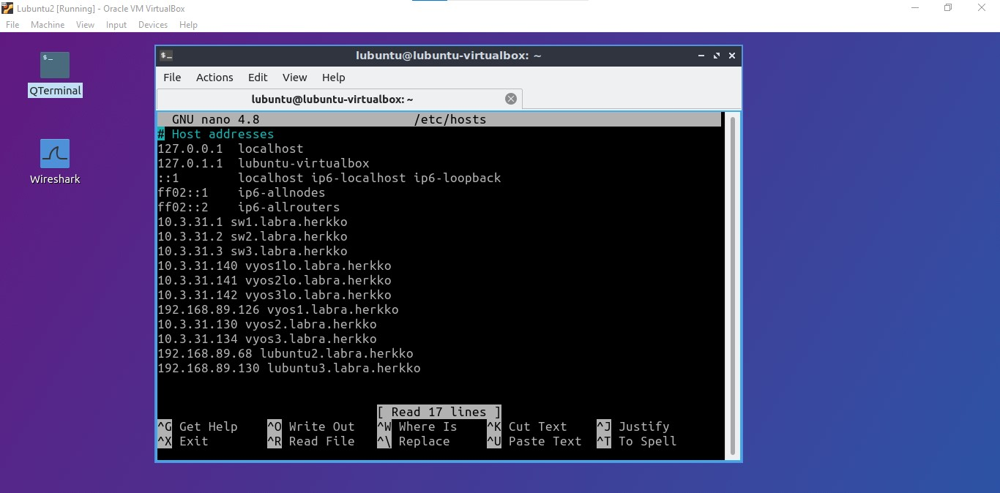
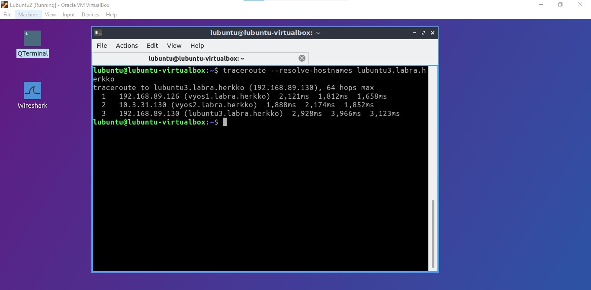
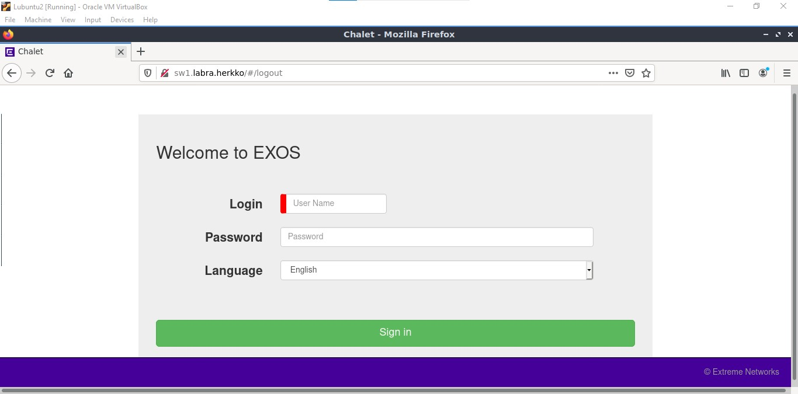
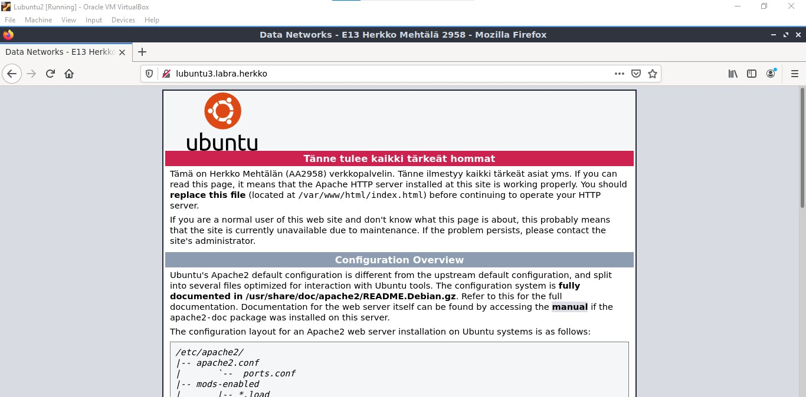
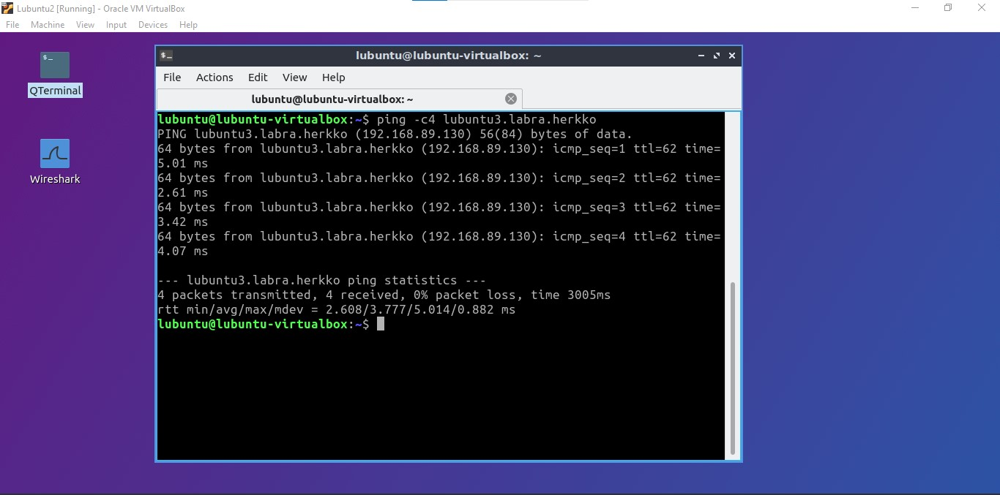

# DNS

## DNS in topology

Paikallisen DNS tiedoston luominen onnistuu `etc/hosts` -tiedostossa. Muokkaan sitä komennolla `sudo nano etc/hosts`  

Annan kaikille kytkimille, lubuntuille ja router loopback osotteille oman nimen.  

  

Tämän jälkeen testailen eri komentoja ja protokolleja ja katson, mitä tapahtuu.  

Traceroute:  

  

HTTP:  

  
  

Ping:  

  

Näyttää siltä, että paikallisen DNS tiedoston luominen onnistui!  

